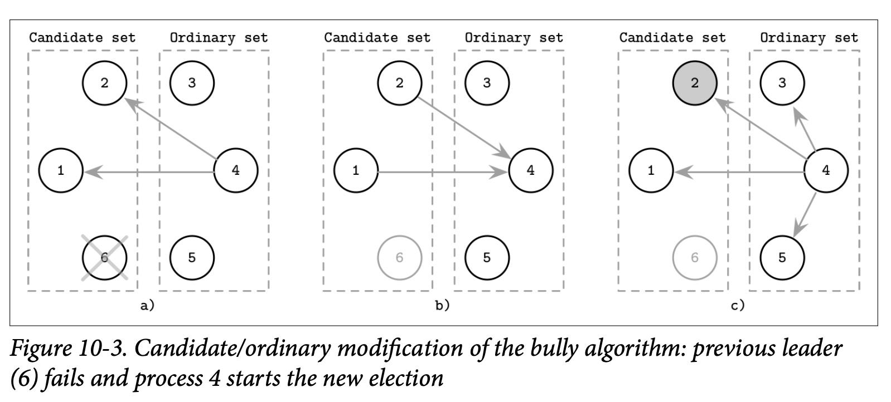

# Candidate/Ordinary Optimization

另一个尝试降低消息数量的算法是将节点分割成两个子集，一个是 *Candidate* 候选人，另一个是 *Ordinary* 普通节点，并且只有换选人节点最终才能够成为领导者。

普通节点通过联系候选人节点来初始化一个选举，收集候选人的信息，选择排名最高的活跃候选人作为新的领导者，然后将这个选举的结果通知给其他的节点。

为了解决同时发生多个选举的问题，算法的处理器会使用一个变量局点 δ 来决定处理器的延迟，将节点之间显著的区分开来，这样就能够让一个节点在其他节点之前来启动这个选举。局点的时间通常会大于消息往返所需的时间，而具有较高优先级的节点会具有较低的 δ，他们之间的关系是相反的。

Figure 10-3 展示了选举处理的步骤

- *a)* 普通处理器 4 发现领导者处理器 6 发生故障，他联系了候选人集合中的处理器，并开启了新一轮的选举
- *b)* 候选人响应了处理器 4 告知他自己是活跃的
- 4 通知所有的处理器新的领导者是 2

