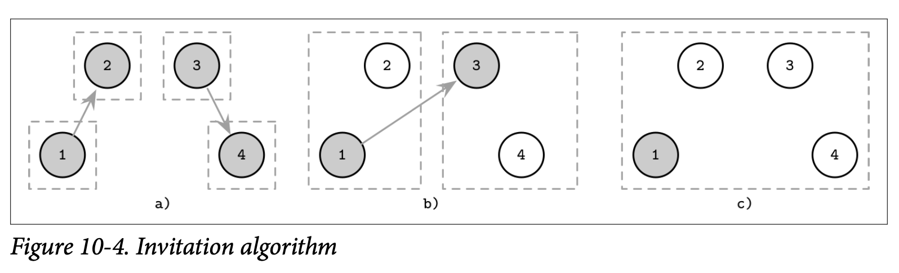

# Invitation Algorithm

*Invitation Algorithm* 允许处理器们去 *Invite* 邀请其他的处理器加入自己的组中，而不是尝试提高自己的级别去超过他们。这个算法的定义允许存在多个领导者，因为他允许每个组都有自身的领导者。

每个处理器都会作为一个新组的领导者启动，这个新组在一开始只有唯一的一个处理器。这时组的领导者会联系其他那些不在自己组内的节点并邀请他们加入。如果对方节点就是一个领导者，则两个组会进行合并，否则的话这个被联系的节点会返回该组领导者的 ID，让两个组的领导者可以建立连接然后使用少量的步骤来完成组的合并。

Figure 10-4 展示了 *Invitation* 算法的执行步骤

- *a)* 四个处理器都作为各自组的领导者启动，1 邀请 2 加入他的组，3 邀请 4 加入他的组
- *b)* 2 加入了处理器 1 的组，4 加入了处理器 3 的组，然后第一个组的领导者联系了 3，也就是另一个组的领导者。然后剩下的组员 *(也就是 4)* 会被通知他的组更换了新的领导者
- *c)* 两个组合并后 1 成为了这个扩展后的组的领导者

在组被合并时，选择哪个组的领导者来作为新的领导者并不是很重要。为了最小化合并组时所需的消息数，较大组的领导者会成为新组的领导者，这样的话就只要通知较小的那个组的成员领导者发生了变更。

类似其他讨论过的算法，这个算法允许处理器被防止到多个组中并同时具有多个领导者。这个 *Invitation Algorithm* 能够在无需触发新选举的情况下创建跟合并组，减少了完成玄虚所需的消息数量。