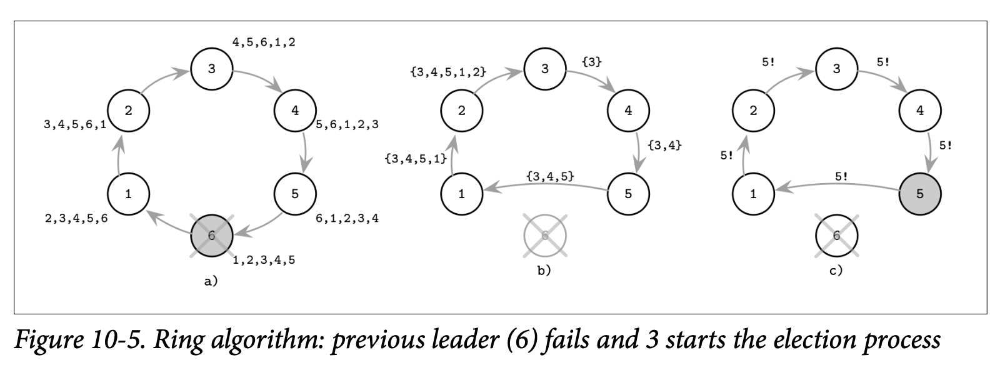

# Ring Algorithm

在 *Ring Algorithm* 中，系统中所有的节点都以一种环的拓扑方式进行构建 *(比如每个节点的前驱跟后驱都在环中)*。当处理器检测到领导者故障时，他会启动新的一轮选举。选举的消息会沿着环往前递进：每个处理器会联系他的后驱 *(即在环中跟他最接近的下一个节点)*，如果这个节点不可用，这处理器会跳过这个节点，尝试去联系这个节点的下一个节点，直到最终能够得到响应为止。

节点跟随着环联系他的邻接节点以及收集所有活跃的节点集合，在进入下一个节点之前会将自己加入到这个集合之中，类似我们在 *Timeout-Free Failure Detector* 中的故障检测算法，节点在将消息发给下一个节点前会将自己的唯一标识符加入到传播路径中。

这个算法会完整的绕着环进行处理，当消息重新回到发起选举的节点时，仍然活跃且具有最高排名的节点会被选为领导者。在 Figure 10-5 中你可以看到这个遍历的示例

- *a)* 上一个领导者 6 崩溃了并且每个处理器对这个环都具有与该领导者相同的视角
- *b)* 3 初始化了新一轮选举并开始进行了遍历，在每一步中，都会保存已经遍历的节点集合，但因为 5 无法触达 6，因此他会跳过 6 直接到 1
- *c)* 因为 5 是具有最高排名的节点，3 初始化了新一轮的消息来告知其他节点新领导者的信息

这个算法的变种包括一种只收集最高排名节点的标识符，而不是手机所有节点的集合，因为最大值是可交换的，知道当前最大的值就已经足够了。当算法回到发起选举的节点时，最后知道的最高排名的标识符会被再次传递到整个环中。

因为这个环可能会被分成两个或更多的分区，并在每个分区中都选出了自己的领导者，因此这种实现方式也是不满足安全性的。

正如你缩减的，为了让系统能在领导者管理下正常的工作，我们需要知道当前的领导者的状态 *(不管他是活跃与否)*。为了能让处理器保持良好的组织并且能够正常的运转，管理者必须得活跃并且能被访问到及实现他的责任。为了检测领导者 崩溃，我们可以使用一些错误的检测算法来实现。