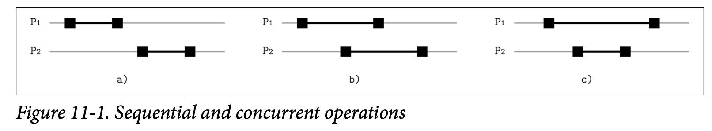

# Shared Memory

对于客户来说，分布式系统存储数据的方式就像使用一个共享存储器，跟单个节点的系统没什么区别。内部的节点通过消息传递将其后的真实场景隐藏了起来。因此创建了一个使用共享内存一般的错觉。

存储器的一个称为 *Register*  寄存器的独立单元可以通过读取或者写入操作被访问到，在分布式数据库中，我们可以将 *Shared Memory* 共享内存看成一个存储器的数组。

我们通过操作的 *Invocation* 调用跟 *Completion events* 完成事件来定义操作的状态，如果一个操作在完成之前崩溃了，则这个操作被定义为 *Failed* 失败的。如果一个操作的调用跟完成时间都在另一个事件之前，我们称这个操作 *Preccdes* 先于另一个操作，而这两个操作之间是有序的，否则的话，他们之间就是并行的。

在 Figure 11-1 中，你可以看到处理器 P~1~ 跟 P~2~ 在执行不同的操作：

- *a)* 处理器 P~2~ 执行的操作会在 P~1~ 已经完成之后执行，因此两个操作是有序的
- *b)* 操作器的操作存在重叠部分，因此两个操作是并行的
- *c)* P~2~ 的操作在 P~1~ 之后启动但在 P~1~ 之前完成，因此这两个操作也是并行的

多个读取者或者写入者可以同时的访问寄存器，在寄存器上执行的读取跟写入操作并不是立即进行的，他们需要花一些时间。在不同的处理器上进行并行的读取跟写入操作并不是连续的：这取决于寄存器在操作产生重叠是的行为，他们可能会存在不同的顺序跟产生不同的结果。这取决于寄存器在并行操作中的行为，我们将寄存器按类型分成了三种：

- *Safe*

  在并发写期间对安全寄存器的读取可能会返回一系列寄存器内的任意一个值 *(听起来并不是很切合实际，但这也解释了异步的系统对于执行的顺序并没有做出强制的要求)*。并行执行读取跟写入的具有二进制值的安全寄存器的值可能会不断变化 *(比如返回结果可能会在两个值之间变换)*。

- *Regular*

  常规寄存器相比之下会具有略微强一些的保证：读取的操作只会返回最近返回的写操作的结果或是返回与该读取操作产生重叠的写操作的值。这种情况下系统开始对顺序有一些概念了，但是写入的操作还并不是对所有的读取者都是可见的 *(比如，这可能会在数据库的从库上，即所有的写入操作都会由主库接收，并将结果复制到其他的节点来提供读取的操作)*。

- *Atomic*

  原子寄存器保证了可线性化：所有的写入操作都有一个时间点，在这个时间点之前的的读取操作返回旧值，在这是时间点之后的读取操作会返回新值。原子性是一个基础的属性，他简化了对系统状态的推理。