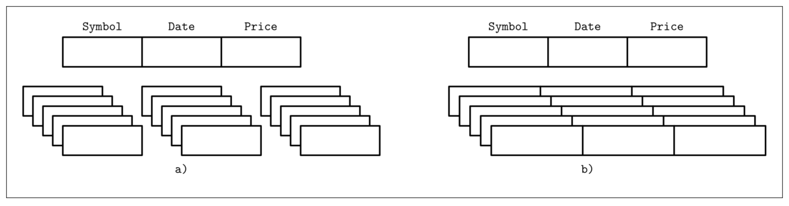
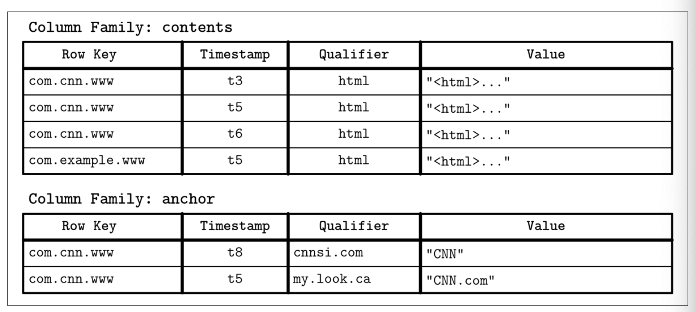

## Column- Versus Row-Oriented DBMS

大部分的数据库都会存储一系列的数据记录，这些记录集合称为 `Table` 表 ，表则由  `Column` 列跟 `Row` 行组成。`Field` 字段是行与列的交集: 他是单一的某些类型的值。属于同一个列的字段往往具有相同的数据类型，比如如果我们定义了一个表用来保存用户记录，那其中的用户名都会是同一个类型并且属于同一个列。属于同一条记录的值的集合则形成一行 *(往往会使用某个 key 来作为这行的标识符)*。

有一种用来对数据库进行分类的方式是看数据是如何在磁盘中存储的：基于行的或基于列的。数据表能够按照**水平** *(将属于同一行的数据保存到一起)* 或者**垂直** *(将属于同一列的数据保存到一起)* 的方式进行分区。Figure 1-2 描述了其中的区别： (a) 展示了按照列进行分区的数据，(b) 展示了按照行进行分区的数据。



面向行组织数据的数据库有: MySQL、PostgreSQL，以及大部分的传统关系型数据库都是。有两个开源的先驱列式数据库，分别是 MongoDB 跟 C-Store *(C-Store 的前任是名为 Vertica 的开源数据库)*

### Row-Oriented Data Layout

面向行的数据库管理系统使用记录或行来存储数据。他们的布局非常接近表格式的形式，即每一行都拥有相同的字段集合。比如面向行的数据库可以高效的存储用户实体信息，包括名字、出生日期跟电话号码:

| ID   | Name  | Birth Date  | Phone Number   |
| ---- | ----- | ----------- | -------------- |
| 10   | John  | 01 Aug 1981 | +1 111 222 333 |
| 20   | Sam   | 14 Sep 1988 | +1 555 888 999 |
| 30   | Keith | 07 Jan 1984 | +1 333 444 555 |

使用多个列组成一行 *(如这里的名字、出生日期跟电话号码)* 并用一个键来作为唯一标识符 *(在这里是一个自增的数字)* 的方式能够适应许多的场景。如用户记录中的所有字段常常会被同时读取；创建记录时 *(如用户填写了注册表单)* 能够将所有信息同时写入存储引擎；同时每个字段也能够单独的进行修改。

面向行的存储在大部分按照行来访问数据的场景中都非常有用，而存储整行的数据也同时提高了其空间局部性。

因为数据在如磁盘这类持久化介质上一般都是以 `Block` 块的方式来访问的 *(换种说法就是，在磁盘中最小的访问单元就是块)*，一个单独的块可以包含记录的所有列。这对需要访问整个用户记录的场景是非常高效的，但对于获取多个记录当只需要其中某些列的查询 *(比如只需要获取电话号码)* 来说代价确实比较大的，因为那些不需要的字段也会同时被读取。

### Column-Oriented Data Layout

面向列的数据库管理系统将数据以垂直的方式 *(比如以列的方式)* 而不是整行的方式进行存储。在这里同一个列的数据会以连续的形式存储在磁盘上 *(对比与上一个例子中以行的方式连续保存)*。举例来说，我们存储股票市场的价格，则所有的价格都会存储到一起。不同列的的值会被分割到不同的文件或者是文件段，这让引擎能够高效的根据列来进行查询，因为他们可以单独的获取，而不是读取整行数据然后再丢弃那些查询不需要的列。

面向列的存储对于一些分析及数据聚合的场景非常有效，比如查找趋势，计算平均值等等。处理复杂的聚合常常是从具有非常多列的记录中挑取其中少数的列 *(如本例中的价格)* 进行集中的处理。

作为一种逻辑上的表达方式，股票市场的价格信息依然可以用表的形式来呈现

| ID   | Symbol | Date        | Price     |
| ---- | ------ | ----------- | --------- |
| 1    | DOW    | 08 Aug 2018 | 24,314.65 |
| 2    | DOW    | 09 Aug 2018 | 24.136.16 |
| 3    | S&P    | 08 Aug 2018 | 2,414.45  |
| 4    | S&P    | 09 Aug 2018 | 2,232.32  |

然而物理上的列式存储布局看起来将是完全不一样的，每个相同列的值会保存在更靠近的位置

- Symbol: 1:DOW;             2:DOW;             3:S&P;               4:S&P
- Date:     1:08 Aug 2018; 2:09 Aug 2018; 3:08 Aug 2018; 4:09 Aug 2018
- Price:     1:24,313.655;     2:24,136.16;      3:2,414.45;        4:2,232.32

为了能够重组数据元祖 *(可能对联表、过滤跟多行的聚合分析有用)* ，我们需要在列上维护一些元信息用来定位哪些数据跟哪些列是关联的。如果我们直接将信息记录到值上，那每个值都需要保存这个键，这将导致该信息的大量重复并引起存储空间的剧增。有些列式存储引擎使用了隐含的标识符 *(virtual IDs)* 来作为替代，还使用了值在文件中的位置 *(也可称为偏移量)* 来定位关联的数据。

在最近的几年里，因为有更多需要在庞大数据集上运行复杂查询的需求浮现，我们看到了许多新的列式文件存储结构，如 [Apache Parquet,](https://databass.dev/links/112) [Apache ORC](https://databass.dev/links/113), [RCFile](https://databass.dev/links/114)，同时也有一些新的列式存储引擎如 [Apache Kudu](https://databass.dev/links/115), [ClickHouse](https://databass.dev/links/116) 等。

### Distinctions and Optimizations

说列式存储跟行式存储之间的差别只是存储方式不同是不够的，选择数据的布局只是其中的步骤之一，我们还需要其他的各种方式去优化列式存储引擎。

一次读取同一列的多个值能显著的提高缓存的命中率以及提高计算的效率。在现代的 CPU 中，使用向量化指令能够在一条 CPU 指令中处理多条数据。

将相同类型的数据存储在一起 *(比如数字跟数字、字符串跟字符串一起)* 让数据的压缩率得到了更好的提升。我们还可以根据数据类型来选择不同的压缩算法，这样能根据不同的场景来得到最好的压缩效果。

想知道何时使用面向列还是面向行的存储引擎，你需要了解具体的对数据的访问模式。如果读取数据时是已记录的方式来消费的 *(即每次都需要读取大部分的列)* 并且具体的工作负载是由单个查询跟区间扫描组成的，那面向行的方式能够得到更好的效果。如果扫描需要跳过许多的行，或者分析更多的只需要一小部分的列，那就更值得去考虑使用面向列的方式。

### Wide Column Stores

面向列的数据库很容易跟 `Wide Column Store` 宽列存储混淆，比如 BigTable 或 HBase，他们的数据呈现为一个多重维度的字典，许多的列使用 `Column families` 列族来进行了分组，在每个列族里面的列最终会使用基于行的方式来进行存储。这样的布局对那些使用键值或键值序列进行检索的数据是非常有效的。

Bigtable 论文中的官方例子是 WebTable。WebTable 以时间戳分版本存储了目标网页的内容快照以及其他的一些属性。这些网页使用反转的 URL 链接作为标识符，并且所有的属性 *(如页面内容、锚点、页面的引用等)* 都按照页面获取的时间戳建立了不同的快照版本。用简单一点的方式来描述就是，如 Figure 1-3 所示

```text
{
  "com.cnn.www": {
    contents: {
      t6: html: "<html>..."
      t5: html: "<html>..."
      t3: html: "<html>..."
    },
    anchor: {
    	t9: cnnsi.com: "CNN"
    	t8: my.look.ca: "CNN.com"
    }
  }
  "com.example.www": {
  	contents: {
  		t5: html: "<html>..."
  	},
  	anchor: {}
  }
}
```

数据按照多个维度存储到一个具有层次结构的有序的字典内：我们能够通过网页的反转 URL 来定位到特定页面的内容或者锚点的指定时间戳版本。每一行都使用称之为 *row key* 的键建立了索引。相关联的列则按照列族进行了分组 -- 如示例中的 contents 跟 anchor 列族，因此不同列族的数据会在磁盘上分开存储。每一个列族内的列都以称为 `column key` 的键作为标识符，他们是以列族名跟列名 *(如示例中的 html, cnnsi.com, my.look.ca)* 所组合而成。列族会按照时间戳存储数据的多个版本。这个布局允许我们快速的定位高层级的实体 *(如本例中的网页)* 跟他们的参数信息 *(如网页中的内容及其他页面的链接的各个版本)*。

对理解 `Wide Column Store` 的各个概念是非常有用的，他们的物理布局相对其他的有很大不同。对列族的一个略为粗略的结构图在 Figure 1-4 展示：每个列族被独立的进行存储，但同一个列族内的数据是集中存储的。

