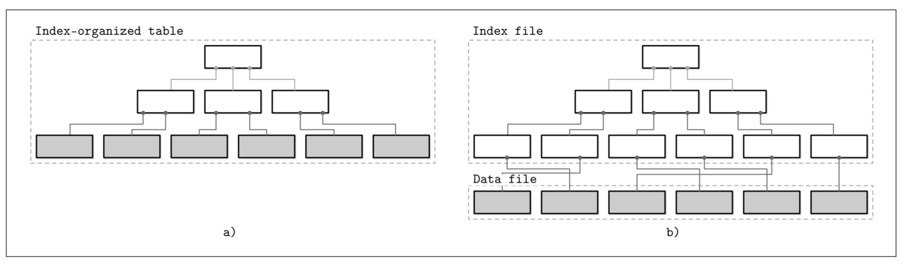
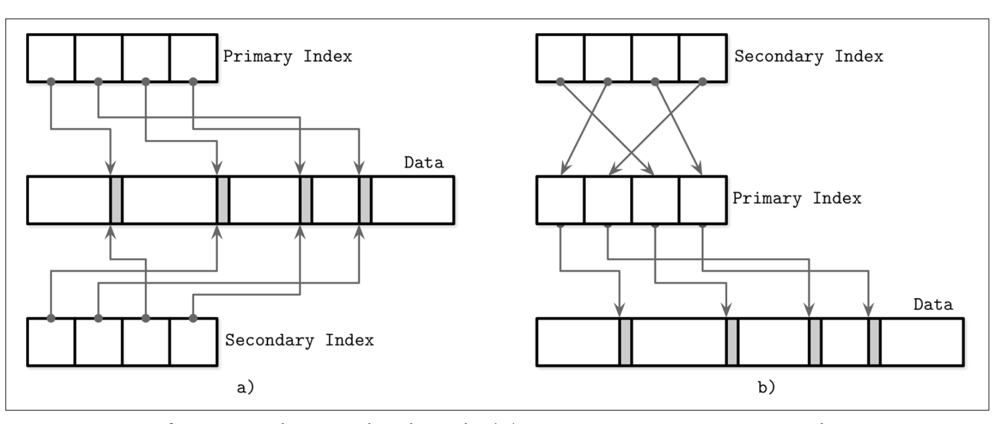

## Data Files and Index Files

数据库系统的主要目标就是能够存储数据然后在需要的时候能够快速的进行读取。但数据应该如何组织呢？为什么我们需要使用数据库管理系统而不是直接管理一大堆的文件？文件要如何组织才能高效的使用呢？

数据库确实使用文件来存储我们的数据，但他并不是直接使用了文件系统的目录跟文件的结构来定位数据记录，他实现了自定义的文件存储格式来组织文件。在扁平文件上使用自定义文件格式来组织的主要原因有：

- Storage efficiency 高效存储

  文件的组织最小化了存储每条数据记录的开销

- Access efficiency 高效访问

  能够在最小化的步骤中快速定位所需的数据记录

- Update efficiency 高效更新

  对记录进行更新时，能够最小化对磁盘数据的修改

数据库系统以表的形式存储数据记录，表则是以字段来组成，一般来说每个表都会以独立的文件来表示。表中的每条记录都能够以 `search key` 来进行定位。为了定位到某条记录，数据库系统使用了索引：一种辅助性的数据结构，他帮助数据库系统能够在不需要对整个表进行扫描的前提下高效的定位数据。索引使用了表字段的子集进行构建，并以对应的自己作为该记录的新的标识符。

一般来说数据库系统会把数据文件跟索引文件区分开：数据文件存储具体的数据记录，索引文件则存储记录的元数据并使用该元数据来从数据文件中定位数据。一般来说索引文件都会比数据文件要小。文件会以页来进行分区，而页的尺寸一般会跟磁盘的块大小对应。页一般会被组织为一系列的记录或是一系列的分槽页。

新的数据记录 *(比如新插入的数据)* 跟对现有记录的更新会被表现为一系列的键值对，大部分现代的存储系统并不会明确的删除数据，相反，他们使用 `deleteion markers` 删除标识 *(或称为 tombstones)* 作为删除的元数据，例如是一个 Key 或是一个时间戳。那些由删除或更新被标记的记录所占用的空间会在垃圾回收时进行回收，比如读取其对应的页，将仍然存活的记录写入到新的位置，并且丢弃掉已经删除的那些。

### Data Files

数据文件 *(有时也称为 Primary files 主文件)* 能以 *Index-organized tables* *(索引组织表 IOT)* 或 `heap-organized tables` *(堆文件 heap files)* 或 `hash-organized tables` *(哈希文件 hashed files)* 的方式实现。

存储在堆文件的记录不需要遵从某些特定的顺序，在大部分情况下他们按照写入的顺序来排序。使用这种方式在有新页面添加进来时无须花费额外的工作或进行文件重组。堆文件需要额外的索引数据结构来定位到已存储的数据记录，以此实现检索功能。

对于哈希文件，数据记录会存储到桶中，而数据记录的标识符则作为 Key 由哈希函数计算后确认该记录对应的哈希桶。在同一个桶中的数据记录可以按照 Key 来进行排序以提高同一桶中的查找速度。

索引组织表将数据存储在索引上，因为数据记录是以 Key 的顺序存储的，对索引组织表进行区间扫描可以实现为顺序扫描其该表的内容。

当数据记录是存储在独立的文件中时，索引文件将保存数据实体，从而唯一的对数据进行标识并且包含足够的信息用来定位记录在数据文件的位置。比如，我们可以保存数据文件的偏移量 *(有时也称为 row locators 行定位符)* 或在使用哈希文件时保存桶的 ID，或在使用索引组织表时保存完整的数据实体。

### Index Files

索引是一种用来对存储在磁盘中的数据进行组织并提供高效读取操作的数据结构。索引文件以特定的数据结构通过 Key 定位到数据记录在数据文件中的位置 *(如果使用的是堆文件)* 或是主键 *(如果使用的是索引组织表)* 存储的位置。

对应到主文件 *(数据文件)* 的索引成为主索引，然而在大部分的场景中我们都可以假定主索引都是通过 `Primary key` 主键或是由其他一些键所组成的主键来构建。其他的索引则称为 `secondary` 二级索引。

二级索引可以直接指向对应的数据记录，也可以只是存储其对应的主键。指向数据记录的指针可以存储堆文件或是索引组织表的偏移量。多个二级索引可以指向同一条数据记录，也允许同一个数据记录在不同的二级索引中使用不同的字段作为标识符。主索引文件为每条唯一记录保存了唯一的搜索键，二级索引则允许多条数据记录使用同一个搜索键。

如果数据记录的顺序跟搜索键的顺序是一致的，则称该索引为 `clustered` 聚集索引 *(也广泛的使用 clustering)*。聚集的数据记录通常会保存在同一个文件或者是保障了键的顺序的聚集文件中。如果数据存储在独立的文件中，并且数据记录的顺序跟键的顺序不是一致的，则称索引为非聚集的 *(也会使用 unclustered)*。

Figure 1-5 展示了这两种区别

- a) 两种索引方式在二级索引中引用数据的方式不同
- b) 二级索引使用一级索引来间接的引用数据

> 索引组织表在索引中存储数据，并且是定义为聚集的。主索引绝大部分情况下都是聚集的。二级索引在定义上是非聚集的，他们提供了用非主键的键来快速访问数据的功能。聚集索引可以是索引组织表也可以是索引跟数据文件分离的形式。

大部分的数据库系统都有固定的主键，他可以是用来唯一标识数据记录的列的集合。当主键没定义时，存储引擎会创建一个隐含的主键 *(比如 MySQL 的 InnoDB 会自动添加一个自增的列并自动递增该字段的值)*。

这个技术在许多不同的数据库系统中都使用了：关系型数据库包括 MySQL 跟 PostgreSQL，基于 Dynamo 的 NoSQL 存储如 Apache Cassandra 跟 Riak，文档型的存储则有 MongoDB。还有其他未提到的名字，但他们中的大部分都是使用了这个技术。

### Primary Index as an Indirection

在数据库社区中，对选择文件偏移量还是主键索引作为对数据记录的引用存在不同的意见。

两种做法各有其优点跟缺点，但最好还是需要在他们的完整实现上进行讨论。如果直接引用数据本身，我们可以减少对磁盘的读取，但在需要付出更多的代价来处理数据的更新或是重新分配的情形。使用间接引用主索引的方式允许我们无需为数据的更新付出额外的代价，但却会带来额外的读取操作。

更新索引在工作负载中绝大部分是读取操作时是是可行的，但这个方式并不适用于有多个索引且存在大量写的工作负载。为了减少数据更新的成本，有些实现使用主键来代替偏移量作为间接层。比如 MySQL 的 InnoDB 使用主索引并执行了两次查询：第一次在二级索引中进行，第二次则在主索引中进行。相对于在二级索引中存储偏移量的做法，这增加了对主索引进行读取的开销。

Figure 1-6 展示了两种方式的区别

- a) 两种索引直接从二级索引引用数据条目
- b) 二级索引需要使用主索引间接的定位数据实体

还有另外一种混合使用数据文件偏移量跟主键的方式。首先，需要检查文件的偏移量是否有效，如果偏移量失效了则需要付出额外的开销到使用主键到主索引查询，最后在找到新的偏移量时去更新二级索引。