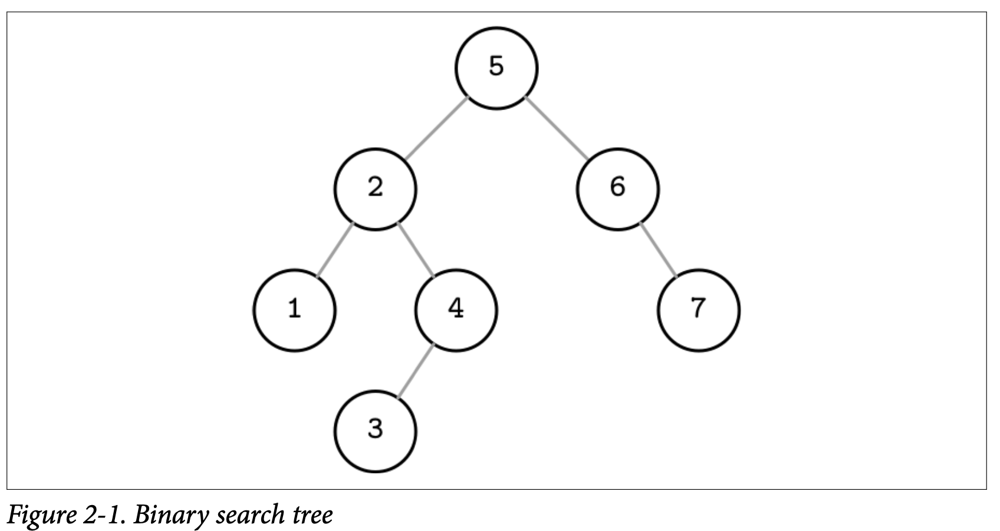
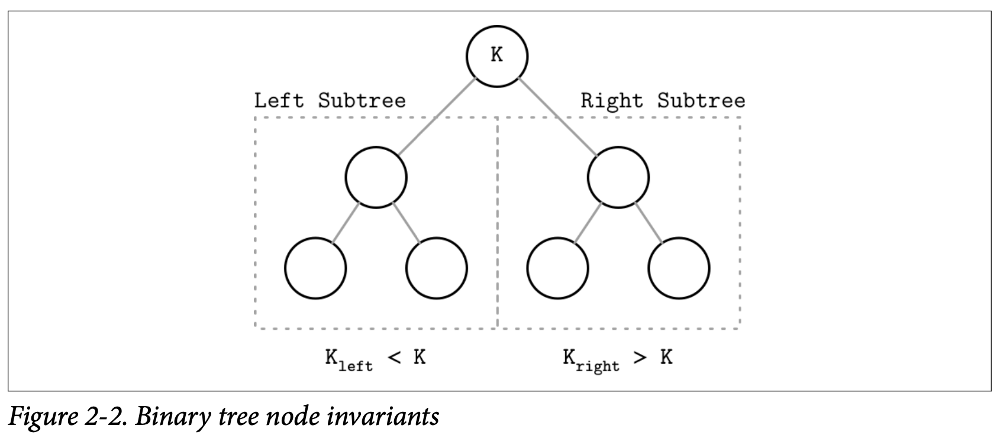
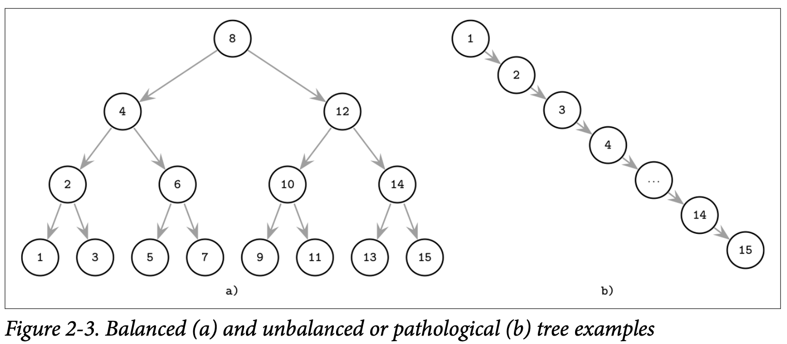

## Binary Search Trees

二叉搜索树 *(BST)* 是有序的内存数据结构，被用来提供高效的基于键值对的查找。BST 包含了许多的节点，每个树的节点都呈现为一个 Key 及跟该 Key 相关联的数据，每个节点有两个子节点 *(因此取名二叉)*。BST 从一个单独的名为 *root* 的节点开始，并且一棵树只允许有一个 *root* 节点。Figure 2-1 中我们展示了个二叉搜索树的例子

每个节点将搜索空间分割为左子树 `subtrees` 跟右子树，正如 Figure 2-2 展示的，一个节点的 Key 会大于其左子树的所有节点，并且会小于其右子树的所有节点。

从 root 开始沿着左子树一直遍历到最左的叶子节点 *(叶子意味着他不具有子节点)* 就能定位到树中最小的 Key 以及其关联的数据。同样的，沿着右子树一直遍历到最右的叶子节点能够定位到树中最大的 Key 及其关联的数据。关联的数据允许存储在树中的任意节点中，然后查找会从 root 节点开始，但可能会在非叶子节点就被中断或返回，比如已经在较高的层级中找到了对应的 Key。

### Tree Balancing

插入的操作并不会遵循哪种指定的方式，元素的插入可能会导致树失去平衡 *(比如其中一个分支比其他的分支要长)*。在 Figure 2-3 中展示了最严重的场景，其中展示了一颗看起来更像是链表的病态的树，作为一个设计目标是对数复杂度的树 *(如 Figure 2-3 )*，最后演变成了线性复杂度。

这个例子可能将问题描述的略微极端了，但他说明了为什么树需要平衡性: 尽管不是所有的节点最后都会往一边倾斜，但毫无疑问的是这种情形会显著的降低查询效率。

一个平衡的树的高度是被定义为了 Log2N，N 是指树中所有节点的总数，并且左右两颗子树的高度只差不会超过一。在失去平衡时，我们会失去二叉搜索树的结构给我们的性能优势，并且插入跟删除操作也会影响树的形状 *(平衡)*。

在一颗平衡的树中，在平均情况下每次进入左子树或右子树都能够减少一半的查找空间，所以查找的复杂度为 O(log2 N)。如果树是失衡的，最差的情况下复杂度会增长为 O(N)，因为我们最终可能会遇到树的所有节点都在同一侧的情况。

为了不产生在添加新元素后其中一侧分支越来越长，另一侧却还是空的情况 *(如 Figure 2-3 (b))*，让树继续保持平衡。可以通过重新组织树的节点来降低树的高度，并让两侧分支的差距保持一定的边界。后

其中一种保持树平衡的方法是在添加或删除树的节点对其进行翻转。如果插入的操作导致让当前分支失衡 *(分支里两个连续的节点只有一个子节点)*，我们就可以 *rorate* 旋转中间的节点，如 Figure 2-4 中展示的，对 `node(3)` 进行旋转，我们称它为 *pivot* 节点，旋转后将它提高几个层级，并且将它的父节点设为右子节点。

### Trees for Disk-Based Storage

如前面提到的，失衡的树有着糟糕的 O(N) 的复杂度。平衡树给我们的平均复杂度应该是 O(log2 N)。在这个时候下，由于扇出量很低 *(扇出量是我们允许的节点所能拥有的最大子节点数)*，我们需要频繁的去维持树的平衡，旋转节点，并更新对应的指针等信息。高昂的管理成本让 BST 作为基于磁盘的数据结构成了不现实的选择。

如果我们希望在磁盘中管理 BST，需要面对几个问题。其中一个是局部性：数据是以随机的顺序添加的，没办法保证新增的节点会写到其父节点附近，这意味着节点的子节点可能会在多个磁盘页中保存。我们可以通过调整树的布局跟使用基于页的二叉树来改善这种情况。

另外一个问题跟子节点也是紧密相关的，就是树的高度。因为二叉树的扇出量只有二，因此高度是树节点总数的以二为底的对数，因此我们需要花费 O(log2 N) 次寻址来定位需要查找的元素，并导致相同次数的磁盘数据传输。2-3-Tree 跟其他扇出量低的树都具有相同的限制：他们可以高效的在内存中使用，但较少的节点数意味着将他们应用到外部存储器时变得不现实。

一个拙劣的基于磁盘的 BST 实现需要许多的磁盘寻址来做比较，因为他没有建立起局部性的概念。这让我们踏上了寻找具有这种特性的数据结构的路。

考虑到这些因素，一个能够适配磁盘的树的实现需要满足下面两个特性：

- *Hight fanout* 高扇出能够提高邻接节点的局部性
- *Low height* 低高度能够减少查找过程所需的次数

> 扇出跟高度有着一个相反的关系：更高的扇出量意味着更低的高度。如果扇出很高，每个节点能够持有的子节点数会更多，这减少了整体的节点数，因此也会产生更低的高度。