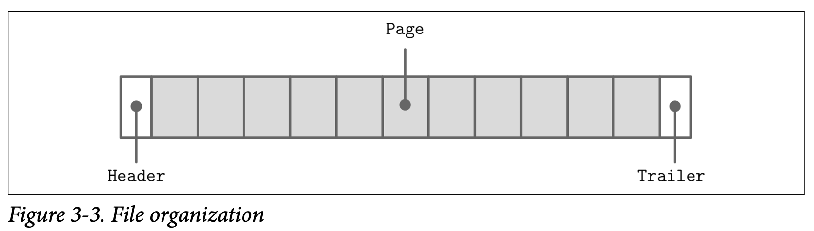

## General Principles

通常来说，设计文件格式考虑的第一个问题就是怎么实现地址的定位：文件会被拆分为相同大小的不同页，这些也可能会用一个单独的块或是多个连续的块来表示。大部分实现就地更新的存储数据结构的页都会使用相同的尺寸，这样能够明显的简化对数据的读取跟写入。只进行添加的存储数据结构已经常会基于页来进行写入：记录被添加到内存的末端，在内存中的页被填满时才会刷到磁盘上。

这个文件通常会以固定大小的 *header* 头部信息开始，然后再以固定大小的 *trailer* 尾部信息结束，他们保存了一些能够快速访问的元信息又或者是用来支持对文件其他部分数据进行解码所需的信息。文件的其他部分会按页进行分割，Figure 3-3 展示了文件的整体结构。



大部分存储数据的表都会有固定的结构、长度、顺序跟字段类型，一个紧凑的结构能节省大量的磁盘空间：我们可以使用字段固定的定位信息来来定位数据，而不是在每条数据中保存每个字段的名称。

如果我们想要设计一个企业员工的记录的格式，用来保存其名称、生日、税号跟性别等信息。实现的方式有许多种，在这里我们将具有固定长度的字段 *(如生日跟税号)*信息保存到数据结构的头部，然后在头部之后保存可变长度的数据。

```
Fixed-size fields:
| (4 bytes) employee_id                |
| (4 bytes) tax_number                 |
| (3 bytes) date                       |
| (1 byte)  gender                     |
| (2 bytes) first_name_length          |
| (2 bytes) last_name_length           |

Variable-size fields:
| (first_name_length bytes) first_name |
| (last_name_length_bytes)  last_name  |
```

现在我们可以通过访问头部固定数据之后的 *first_name_length* 个字节来得到 *first_name* 字段。 我们可以通过累加 *last_name* 之前的可变长度字段的大小来得到其地址。为了避免计算过多的字段，我们可以将偏移量跟长度都编码到头部的固定长度区。这样的话就可以单独的定位每个可变长度字段了。

构建更复杂的数据结构通常会需要更多的层次结构: 字段通过基础类型组成，单元由字段组合成，页面由单元组成，扇区由页面组成，区域有扇区组成等等。在这里并没有什么严格的规则是必须要遵守的，所有的定义只取决于你所需的数据结构是怎么样的。

数据库文件通常会分成多个部分，他会通过一个查询表来帮助定位跟指向这些部分在文件头、文件尾或独立文件中的偏移量。