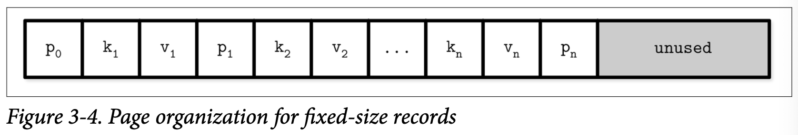

## Page Structure

数据库系统将数据记录存储在数据文件跟索引文件中，这些文件被分割成多个具有固定大小的页，这些页的尺寸一般是多个文件系统块的大小，一般来说会在 4 到 16Kb 之间。

接下来我们看一个 B-Tree 节点 节点的例子。从数据结构的角度看，B-Tree 的叶子节点会保存 Key 跟具体的数据记录作为键值对，而非叶子节点则保存 Key 跟指向其他节点的指针信息。每个 B-Tree 的节点都会占用一个或多个连续的页，因此在 B-Tree 的上下文中我们会交替的使用节点、页 *(或者还有块)* 来表示同一个概念。

原始的 B-Tree 论文描述了一个简单的页结构来保存固定长度的数据记录，这个结构保存一连串的元祖，就如 Figure 3-4 中展示的：Key 缩写为 $k$，关联的 Value 缩写为 $v$，以及指向子页面的指针缩写为 $p$ 。

这种方式很容易理解，但存在一些缺陷：

- 在右侧之外的位置添加数据需要对元素进行定位
- 不允许高效的管理或访问可变长度的记录，只能处理固定长度的数据