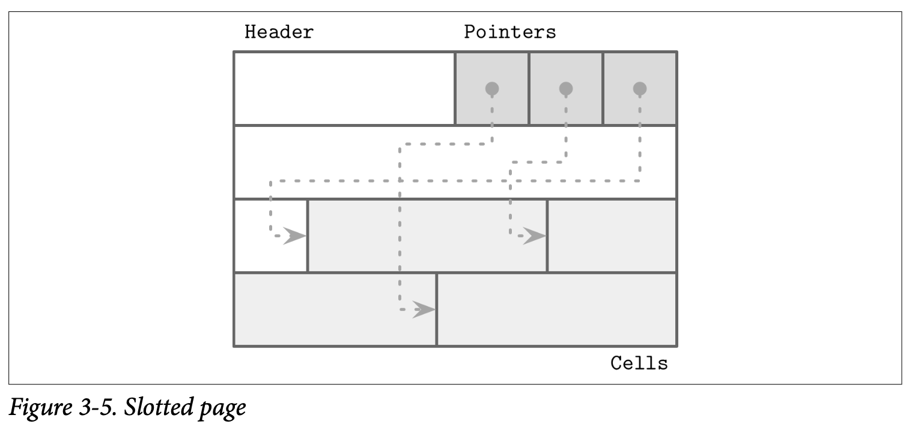

## Slotted Pages

在存储可变长度的记录时主要的问题来自于对空闲空间的管理：回收已经被删除数据的记录所占用的空间。如果我们尝试将新的大小为 n 的记录放到之前占用空间大小为 m 的位置，除非 $m == n$ 或者可以找到其他大小等于 $m - n$ 的记录，否则部分的空间就被闲置了。类似的，一个大小为 m 的数据段不能够用来保存一个比他还大的尺寸 k，所以最后会选择插入新的数据而不是回收未使用的空间。

为了简化可变长度记录的空间管理，我们将页切分为固定长度的段，但是这样做同时也导致我们也浪费了一部分的空间。加入我们使用大小为 64 个字节的段，除非记录的大小都是 64 的倍数，不然在插入大小为 $n$ 的记录时我们就会浪费 $64 - (n \mod 64)$ 个字节，话句话说，除非记录的大小都是 64 的倍数，否则有些块的大小就只有部分填充了。

空间回收可以使用重新页跟迁移数据记录来实现，但这样我们就需要去维护记录的偏移量了，因为有一些不在本页内的指针可能会使用到这些偏移量。当然，尽量去减少空间的浪费是非常值得的。

总结，我们需要页格式能够支持我们：

- 保存长度可变的记录，以最小化开销
- 在删除记录时能够回收占用的空间
- 对页面中记录的引用不需要去考虑他们具体的位置 *(即偏移量？)*

为了能够高效的存储如字符串、二进制数据这些长度可变的庞大的对象，我们可以使用称为 `slotted page` 分槽页 *(即页面中有许多的 slot 槽)* 或 *slot directory* 分槽目录 的技术。这项技术被用在了许多数据库中，比如 PostgreSQL。

我们将页组织成一个 *slot* 或 *cell* 的集合并且将指针跟 *cell* 以相反的方向独立的存储在页中不同的存储区。这意味着我们可以通过重新组织指针指向的 *cell* 来维持其顺序，而且删除记录可以通过将删除指针或将其设为空来实现了。

分槽页有一个固定长度的头部，其中保存了页跟 `Cell` 相关的重要信息。*Cell* 可以不同的大小，用来保存与其匹配的数据：键、指针、数据记录。Figure 3-5 展示了分槽页的结构，每个页都会有个成为头部的管理区域，以及 Cell 跟指针。

现在来看看这个方法是如何解决我们开头提到的问题的：

- 最小化开销：带来的唯一的开销是指针数组管理的数据记录的具体位置信息
- 空间回收：空间可以通过对页进行碎片整理跟重写来完成
- 动态布局：对于外部的页来说，通过 Slot 对应的 ID 来建立引用，因此内部具体的偏移量对外部页来说是无感知的