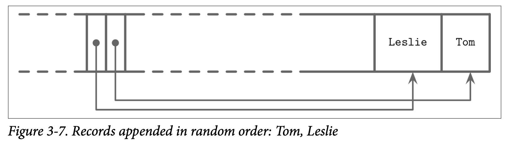
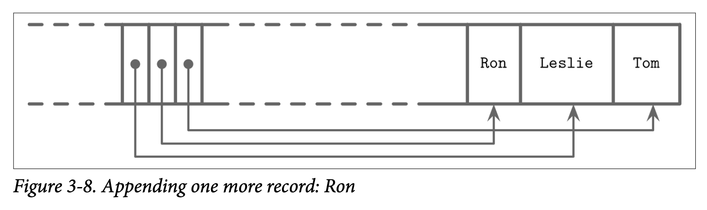

## Combining Cells into Slotted Pages

我们可以使用前面讨论过的 *slotted pages* 分槽页技术来将 Cell 组合成页。我们将 Cell 添加到页的右侧 *(从页的尾部开始)* 并将 Cell 的偏移量跟指针信息保存到页的左侧，如 Figure 3-6 所示

Key 可以以乱序插入页中，然后通过对偏移量指针按照 Key 排序来保持他们的逻辑顺序。这个设计能够以最小的成本来添加新的 Cell，因为在插入、更新或删除 Cell 时不需要对其进行迁移。

现在来看一个保存了名字的页，两个名字被添加进页中，并且他们插入的顺序是先 Tom，然后是 Leslie。如 Figure 3-7 所示，他们的逻辑顺序 *(在这里示例中是字母顺序)* 跟插入的顺序 *(即被添加到页的顺序)* 并不一致。Cell 最终按照插入的顺序保存，但其偏移量列表则被重新排序了，用来支持后续的二分查找。

现在我们往这个页来添加多一个名字：Ron。新的数据被添加到较高地址边界的空闲空间中，但 Cell 的偏移量依然会以字符顺序来排列: Leslie、Ron、Tom。为了实现这个目标，我们需要对 Cell 的偏移量进行重新排序: 在插入点之后的之前会被往右边移动一个位置来空出一个位置存放指向 Ron 的新指针，最后的结构如 Figure 3-8 所示。

