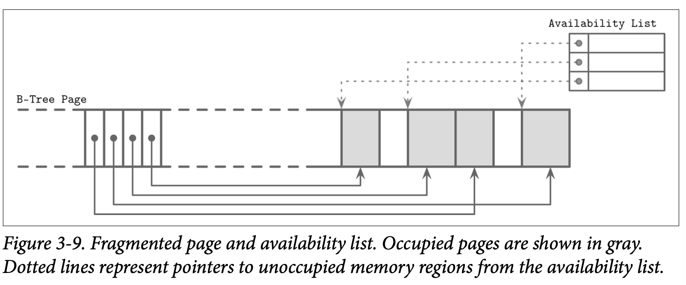

## Managing Variable-Size Data

从页中删除一个元素不需要去删除其对应的 Cell 跟移动其他的 Cell 到空闲的空间，而是将该 Cell 标记为已删除并在内存中使用一个 *availability list* 来记录空闲的内存跟指向空闲内存的指针。这个 *availability list* 保存了空闲数据段的偏移量跟他们的大小。在插入新的 Cell 时，首先需要去检查 *availability list* 是否存在适用的数据段。你可以在 Figure 3-9 中看到带可用段信息的页结构

SQLite 称未被使用的数据段为 *freeblocks* 并将第一个 *freeblock* 的指针保存到了页的头部信息中。此外，他还保存了当前可用的总空闲空间大小，用来快速的检查新的元素是否能够在进行碎片整理后保存到该页中。

是否匹配则是基于以下原则：

- First fit

  这可能会带来较大的开销，因为在使用最先匹配原则复用空间后，可能会导致该 Cell 的剩余空间无法被利用，这可能会导致显著的空间浪费

- *Best fit*

  使用最佳匹配我们会尝试寻找一个插入新数据后，剩余空闲内存最小的 Cell

如果无法找到匹配新 Cell 的连续数据段，但该页中剩余的空闲空间总量却能够容纳新的 Cell，则现在存活的 Cell 会被读取出来然后重新写入来进行碎片整理，以提供空间支撑新的写入操作。如果进行碎片整理后空闲空间总量仍不足以保存新的 Cell，则会创建一个 *overflow page* 溢出页。

> 为了提高局部性 *(特别是在 Key 都比较小的情况下)*，有一些实现会将 Key 跟 Value 独立的保存在叶子中。让所有 Key 保存在一起可以提高查找时的局部性。在定位到查找的 Key 后，会根据其索引来定位到关联的 Value。对于可变长度的 Key，这会要求我们计算跟存储额外的 Cell 指针。

最后的总结，为了简化 B-Tree 的布局，我们假设每个节点都占用一个独立的页。每个页都包含一个固定长度的头部信息、Cell 指针块跟一系列的 Cell。Cell 保存 Key 跟指向子节点或者关联数据记录的指针。B-Tree 使用简单的指针层次结构: 页标识符用来定位子节点在树文件的位置，Cell 的偏移量用来定位 Cell 在页中的位置。

