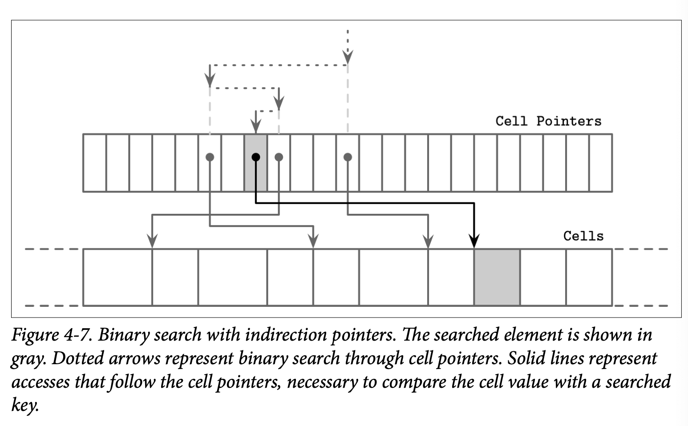

## Binary Search

我们已经在 B-Tree Lookup Algorithm 中讨论过 B-Tree 的查找算法，并提过我们会通过 *binary search* 二分查找算法来定位目标 Key。二分查找只能在有序的数据中使用，如果 Key 是无序的则无法使用二分查找。这也是为什么保持 Key 有序跟维护有序的不变性这么重要。

二分查找算法接收一个有序的数组及需要查找的 Key 最终返回一个数字，当该数字是一个正数时，我们知道他表示的是查找的 Key 在数组中的位置。当该数字是一个负数时意味着查找的 Key 并存在于数组中，同时这也代表了一个 *insertion point* 插入位置。

插入位置表示的是数组中第一个大于查找 Key 的元素的位置。这个数字的绝对值代表查找的 Key 能够在不影响数组顺序的前提下进行插入的索引位置。插入操作可以从插入位置开始，向右以后其之后的元素来得到一个存放新元素的空位。

在较高层级的搜索中一般不会得到完全匹配的结果，我们感兴趣的是搜索的方向，即找到第一个大于我们查找 Key 的位置，并依据他来找到我们需要继续下降进行查找的子树。

### Binary Search with Indirection Pointers

B-Tree 页中的 Cell 是按照插入的顺序保存到 ，只有 Cell 的偏移量会保持逻辑上的顺序性。为了在 Cell 中使用二分查找，我们选择中间 Cell 的偏移量，通过指针定位到具体的 Cell，比较查找的 Key 跟 Cell 中的 Key 来确定下一个需要进行查找的位置是在当前 Cell 的左侧还是右侧，然后继续递归的进行相同的处理，知道找到查找 Key 对应的插入位置。如 Figure 4-7

