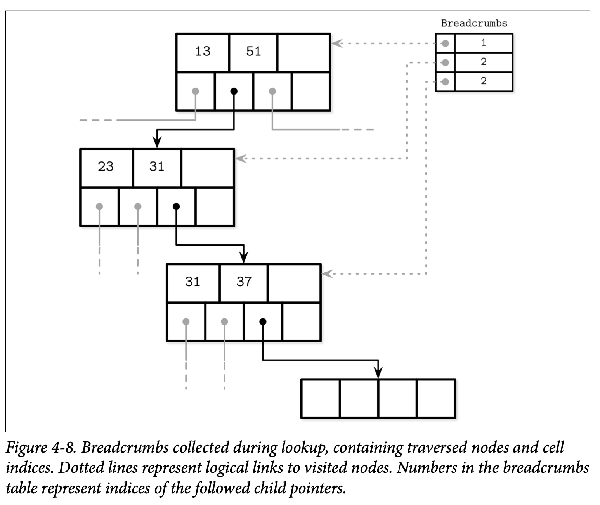

## Propagating Splits and Merges

正如我们在前面的章节中讨论的，B-Tree 的分裂跟合并会被上升到更高的层级。为此我们需要能够从分裂的叶子或合并的节点中一直上升到根节点。

B-Tree 的节点可以包含指向父节点的指针，但因为较低层级的页总是从较高的层级的引用中被加载的，因此没有将该信息持久化到磁盘的必要。

如邻接节点的指针，父节点的指针也需要在父节点发生变化时进行更新。这种情况会发生在具有页面标识的分隔键被转移时发生：如父节点分裂、合并或重平衡了。

有一些实现 *(如 WiredTiger)* 使用父节点的指针用于遍历叶子来避免在使用邻接节点指针时可能发生的死锁。因为使用了父节点指针而不是邻接节点指针来遍历叶子节点，遍历的过程看起来更接近与 Figure 4-1。

为了定位邻接节点，我们可以跟随父节点的指针上升后再递归的下降到较低的层级。当我们遍历到父节点的最后一个邻接节点后，查找会继续递归的上升，直到回到根节点，然后再继续下降到叶子层级。

### Breadcrumbs

相对于在节点中保存跟管理父节点的指针，我们可以记录找到叶子节点过程中所遍历的节点列表，然后在插入导致分裂或删除导致合并时，能够按照节点列表的相反顺序来得到所需父节点。

在可能导致 B-Tree 的结构产生变化的操作中 *(插入或删除)* ，我们首先会从根节点开始遍历直到找到目标的叶子节点跟所需的插入位置，因为我们并不知道执行的操作何时会导致分裂或者合并 *(至少在定位到目标叶子节点前是不知道的)*，所以需要收集这些 *breadcrumbs* 导航信息。

导航信息包含了在分裂或合并发生时，从当前叶子节点上升到根节点所需的引用信息。跟这个信息最匹配的数据结构是 *stack* 栈，比如 PostgreSQL 就使用了栈，在其内部则称为 *BTStack*。

如果节点需要分裂或合并，导航信息可以用来找到 Key 上升到父节点所需的插入位置，以及在需要时可以用来找到需要继续上升的更高层级的节点。这个栈是在内存中进行管理的。

Figure 4-8 展示了一个从根节点遍历到叶子节点的例子，收集的导航信息包含了遍历中遇到的节点跟其 Cell 的索引。如果目标的叶子节点分裂了，则栈顶的元素会被弹出用于定位叶子节点的父节点。如果父节点有足够的空间，则新的 Cell 会被添加到该栈顶元素保存的插入位置 *(假设该索引位置是有效的)* 中；否则父节点也会触发分裂。这个处理的过程会持续递归直到导航信息的栈为空，此时说明我们已经到了根节点了，又或者遇到了无需分裂的上级节点。

