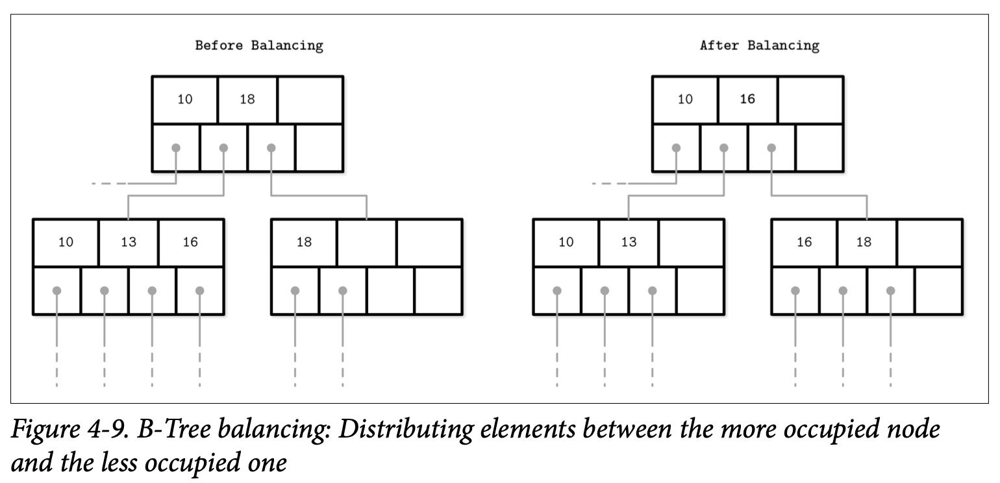

## Rebalancing

有些 B-Tree 的实现会在执行分裂或者合并前，尝试通过 *rebalacing* 重平衡层级内的元素或者将使用率高的节点中的元素移动到使用率低的节点中来分摊分裂跟合并操作的成本。这有助于提高节点的使用率，并使用有可能花费更高管理成本的重平衡来降低树的高度。

插入以及删除的操作中也有机会来维持树的负载平衡。为了提高空间使用率，在节点溢出的时候，不会马上将节点分裂，我们会将节点中的部分元素移动到相邻的节点，以此来为插入提供空间。同样的，在删除时，与其马上对节点进行分裂，我们可以选择移动部分相邻节点中的元素到当前节点，来保证当前节点起码是半满的状态。

$B^\star-Tree$ 会保持数据分布在相邻的节点直到相邻的节点都填满，接着他不是将节点分裂成两个半满的节点，而是将两个节点分裂成三个节点，这三个节点都保持了 $\frac{2}{3}$ 的使用率，SQLite 就使用了这种方式。这种方式提高了平均使用率，因此降低了分裂的可能性，但同时也带来了额外的跟踪及维持平衡的逻辑。更高的使用率同时也意味着更高效的查找，因为这样能保持树有尽量低的高度，跟查询到叶子时能够遍历尽可能少的页。

Figure 4-9 展示了数据在邻接节点的分布，当左节点的元素数量比右节点要多时，元素会从使用率较高的节点移动到使用率较低的节点。因为在相邻的节点中最大最小不变式在平衡中会改变，所以我们还要去更新父节点相关的 Key来保证其正确性。

负载均衡是一种已经在很多数据库实现中使用的技术，举例来说，SQLite 实现了跟我们刚刚讨论的非常类似的 *balance-siblings algorithm* 算法。保持均衡可能会为代码带来一些复杂度，但是因为他的场景是独立的，所以可以在后续的阶段作为优化来实现。