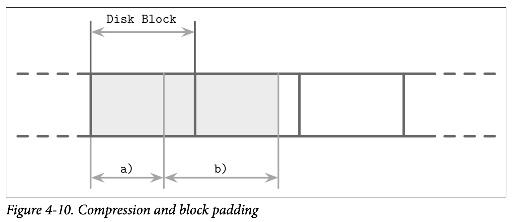

## Compression

存储原始未压缩的数据可能会产生大量的开销，因此许多的数据库都提供了压缩数据用来节省空间的方法。这里有一个需要对访问速度跟压缩率需要作出权衡的点：更高压缩率能更好的减少数据大小，允许我们在单次访问中读取到更多的数据，但可能会导致需要更多的内存及 CPU 来对数据进行压缩跟解压。

压缩可以使用不同级别的粒度来完成，尽管对整个文件进行压缩可以得到更好的压缩率，但同时限制了程序需要在发生更新时对整个文件重新进行压缩，因此更细粒度的压缩对大型的数据集来说更合适。对整个索引文件进行压缩是不现实并且很难做到高效的：为了定位一个特定的页，需要访问整个文件 *(或者是包含了被压缩元数据的段，来定位被压缩了的数据)*  ，解压，使其可用。

一个替代方案是按页来压缩数据。这很匹配我们所讨论的内容，因为我们所讨论的算法一直都是使用固定大小的页的。页能够独立的进行压缩跟解压，因此可以将压缩跟页的读取跟写入结合在一起。然而，在这个案例中因为对页进行压缩会导致页只占了磁盘块的一部分，但数据的传输单元又是基于磁盘块的，所以可能有需要对页的额外部分进行填充。在 Figure 4-10 中，你看看到压缩后的页 *(a)* 占用了少于一个磁盘块的空间，当我们读取这个页时会同时把属于其他页的数据也加载了。而对于跨越了多个磁盘块 *(如 b)* 的页，则会导致我们需要读取额外的块。

另一种方式是指对数据进行压缩，比如基于行 *(压缩整个数据记录)* 或是基于列 *(独立的压缩每个列)*，在这种做法中，页的管理跟压缩是被解耦的。

在写这本书时，大部分开源的数据库都提供了可插拔的压缩方法，可用的压缩库包括如 Snappy、zLib、lz4 等等。

因为压缩算法的效果是依赖于数据集及其他潜在因素 *(如压缩率、性能或内存开销)* 的，我们不会深入对他们的进行比较跟实现细节。已经有许多针对不同压缩算法对不同块的尺寸压缩效果的比较 *(如 Squal Compression Benchmark)*，他们一般关注四个指标：内存负载、压缩性能、解压性能跟压缩率。这些指标对于如何选择压缩库是非常重要的。