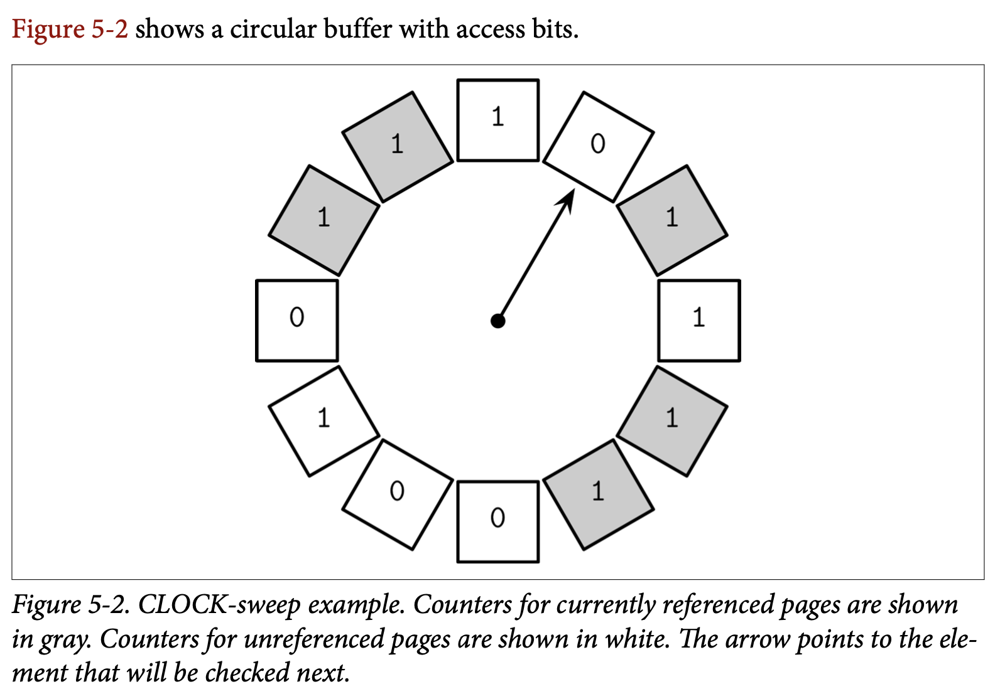

## Buffer Management

大部分的数据库使用了 *two-level* 两级的存储层次结构：较慢的持久化存储 *(磁盘)* 跟较快的主存 *(内存)*。为了减少访问持久化存储的次数，页信息会被缓存在内存中，当存储层再次请求已缓存的页时，会直接返回缓存中的副本。

缓存中的页能够被重用的前提是，我们假设了没有其他的程序会去修改磁盘中的数据。这种做法有时候也被称为 *virtual disk* 虚拟磁盘。虚拟磁盘只会在目标页在在内存中没有可用的副本时去访问物理存储设备。这个概念的另一个更常用的名字是 *page chae* 页缓存或 *buffer pool* 缓冲池。页缓存负责缓存从磁盘中读取出来的页，在数据库系统崩溃或没正确关闭时，缓存的内容将会丢失。

因为页缓存这个词能够更好的体现这个数据结构的目标，因此本书中我们会一直沿用这个名字。另一个缓存池听起来更像是一个用来重用那些空缓存的池，而不是用来共享其内容，共享内容可能是页缓存很重要的一部分，甚至可以是一个独立的组件，但这个名字却完全没有反映出这个目的。

需要对页进行缓存的问题并不局限在数据库这个领域。操作系统也有关于页缓存的概念。操作成系统利用未使用的内存段来透明的缓存磁盘内容，并以此来提高 I/O 系统调用的性能。

我们称从磁盘加载未缓存的页面的操作为 *paged in*。如果一个缓存的页产生了任何的修改，在修改被写回磁盘之前，我们称其为 *dirty* 脏页。

因为用来建立缓存的内存区域中的通常都是远小于整个数据集的，因此页缓存最终会被填满，为了能够缓存一个新的页，则必然会有一个已缓存的页会被从缓存中 *evicted* 驱逐。

在 Figure 5-1 中，你可以看到 B-Tree 的逻辑表示中页、缓存页的版本及页在磁盘中的区别。页缓存从无序的将页缓存到 *free slot* 空槽中，因此缓存中的顺序并没有直接跟磁盘的保持一致。

缓存也的主要功能可以总结为：

- 保持缓存的页面在内存中
- 能够将页面的修改集中缓存起来并进行应用
- 当请求的页不存在于内存且还有足够的空间时，页面会被 *paged in* 到页缓存中，然后返回该页的一个缓存副本
- 如果请求一个已被缓存的页，则会直接返回已缓存的版本>
- 如果已经没有足够的空间来容纳一个新页，有一些页会被驱逐去页缓存并将其内容写入到磁盘中

> ### Bypassing the Kernel Page Cache
>
> 大部分的数据库系统会在打开文件时使用 O_DIRECT 标志，这个标志可以用来绕过内核层级的缓存，并直接的访问磁盘，然后使用数据库中特定的缓存组件，这个操作有时候会被开发操作的人进行直接司改。
>
> Linus Torvalds 批评了 *O_DIRECT* 的用法，因为他不是异步的也没有预读或任何能够指示给内核的访问模式信息。然而，在操作系统能够提供更好的机制之前， *O_DIRECT* 仍让是非常实用的。
>
> 我们可以通过 *fadvise* 来给予操作系统如何进行页面驱逐的建议，但我们能做的也只有向内核提出我们的建议，内核对此并没有任何具体的保证。为了在对 IO 进行操作时避免系统调用，我们可以使用 *memory mapping* 内存映射，但这样我们就失去了对缓存的控制了。

### Caching Semantics

所有对缓存所作的修改会一直保留在内存中直到他们最终被写会磁盘，并且不允许其他的进程对后台的文件做出修改，这个同步的操作是单向的：只会从内存同步到磁盘中。页缓存使得数据库可以更好的控制内存管理跟磁盘访问。你可以将它想象成程序级别类似内核的页缓存东西： 他会直接访问块设备，实现了跟其类似的功能与类似的目标。他对磁盘的访问进行了抽象以及将逻辑的写操作与物理的写操作进行了分离。

缓存页能够帮助我们将树部分缓存在内存中，而无需对算法的实现做出任何修改以及实现对应的内存对象。我们需要的只是将对磁盘的访问替换成调用缓存页。

当存储引擎访问 *(或)* 请求页面时，我们首先检查他是否已经被缓存，如果是的话则会将对应的页直接返回。如果页还未被缓存，则缓存会将页的逻辑地址或页的编号转换成具体的物理地址，从磁盘中将其读入内存后建立缓存，然后将缓存中的版本返回给存储引擎。一旦返回了，缓存了页内容的缓冲区我们称其 *referenced* 被引用了，之后存储引擎需要将其在转换回页缓存或在使用完成之后解除对他的引用。页缓存可以通过指定为 *pinning* 来避免被驱逐。

如果页被修改了 *(比如添加了新的 Cell)*，他将被标识为脏页。一个脏页的标识集合则被用来指示这些页需要被同步跟刷新到磁盘来保证他的持久性。

### Cache Eviction

保持缓存的使用率是很好的：我们可以在无需访问持久化存储的前提下提供更多的读取请求，并且可以合并对同一个页的多次写入。但是，页缓存也是存在着容量限制的，而且为了能够处理新的内容，旧的页迟早需要被驱逐。如果页的内容已经被同步到了磁盘并且该页不是 *Pinned* 或被应用的，那他就可以马上被驱逐。脏页则需要在被驱逐之前先同步到磁盘。被引用的页在其他线程结束对他的引用之前则不应该被驱逐。

为每次驱逐都触发一次刷盘的操作可能对性能会有较大的影响，因此有些数据库使用一个独立的后台线程遍历那些可能被驱逐的脏页，并更新他们在磁盘上的版本。比如 PostgreSQL 就有一个 *background flush writer* 后台刷新器来做这个事情。

另一个需要时刻关注的属性是 *durability* 持久性：如果数据库崩溃了，所有未被刷到磁盘的数据就会丢失。为了确保所有的修改都是持久化的，刷新会使用 *checkpoint* 检查点作为引导信息。检查点控制了 *write-ahead log* 预写日志 *(WAL)* 跟页缓存，并确保他们两者的步调一致。对于那些关联到对缓存页进行操作的 WAL 日志记录，只有在他们所关联的操作已经被刷磁盘后才能丢弃。而那些脏页则需要该处理完成之后才能被驱逐。

这意味着我们会一直需要在下面几点中做出权衡:

- 通过推迟刷新数据的操作来减少对磁盘的访问次数
- 进行预先刷新来快速驱逐页面
- 选择合适的驱逐页面，并按照顺序进行刷新来得到优化效果
- 控制缓存的大小在指定的内存边界范围内
- 避免丢失还未持久化的主存数据

我们探讨了几种用来帮助提高前三个特征的技术，并保持剩余的两个特征也在指定的边界范围内。

### Locking Page in Cache

为每个读取跟写入都去执行磁盘的 I/O 操作是不现实的：可能会有对同一个页的连续请求，同样的对同一个页也可能会接连着产生修改操作。因为 B-Tree 在顶层的入口很单一，更高层级的节点 *(更接近根的节点)* 会命中大部分的读取请求。分裂跟合并同样也会向上传播到高层级的节点。这意味着通过至少将树的一部分进行缓存就能够得到很直观的收益。

我们可以将那些在短时间内有较高可能被平凡访问的页 *lock* 锁定。锁定一个页到内存称为 Pinning 固定，被固定的页会在内存中保存更长的时间，这能够帮助我们通过减少对磁盘的访问次数来提高性能。

因为 B-Tree 中更深的每一级的节点数都是以指数增加的，高层级的节点相对于整棵树来说只占了很小的比例， 树的这部分可永久的保存到内存中，而其他的部分则可以按照需要来将其缓存进内存。这意味着为了执行一个查询时，我们不需要执行 *h* 次磁盘访问了 *(h 是树的高度)*，而是只会在进入较低层级时遇到不在缓存中的页时才进行磁盘访问。

对子树上不同节点所执行的操作可能会导致树的结构产生有冲突的变化，比如，多个删除操作导致的合并跟写入操作导致的分裂之间的冲突。同样的，还可能有来自于不同子树向上传递导致的变化 *(在邻近时间内数据因为树的不同部分向上传递所产生的结构变化)*。这些操作可以先只在内存中执行来对他们进行缓冲，来减少磁盘操作的次数跟分摊操作的开销，比如用一次写操作来替代多次写的操作。

> #### Prefeching and Immediate Eviction
>
> 页缓存同样能够让存储引擎对数据的预读跟驱逐获得更细的控制。他能够在相关的数据被读取前先预加载。比如在对叶子节点进行区间扫描时，区间处理完成后马上驱逐对应的缓存，因为他们可能对其他查询具有较低的用处。比如 PostgreSQL 使用一个 *Circular Buffer* 循环缓存 *(也叫做 FIFO 页替换策略)* 来处理大批量的扫描。

### Page Replacement

当缓存的达到容量上线时，为了保存新的页，旧的页会需要被驱逐出缓存。但是，除非驱逐的是最不可能会很快再次被访问的页，不然我们可能会需要多次把他们给加载回来，因为不可能把所有的数据一直缓存在内存中。我们需要找到一种预估页面是否会被持续访问的方式来优化这种情况。

我们称这种判断页需要被驱逐的依据为 *eviction policy* 驱逐策略 *(有时也称为 page-replacement policy)*。他尝试找到最不可能会马上被访问的页，当旧页被从缓存中驱逐时，新的页就可以被加载到旧页之前的空间了。

我们需要一种高效的替换页的算法来实现页缓存。这个页替换策略需要清晰的方法来判断页之间的顺序，预测出哪些页马上会被访问，以及哪些页可能会在较长的时间内不再被使用。因为请求并不一定会按照某种特定的分布模式到来，因此对这些行为的预测可能会非常复杂，不过，使用正确的页替换策略可以帮助减少的页驱逐的次数。

看起来一种合理的能够减少驱逐次数的最简单的方法是使用更大的缓存，然而事实并非如此。有一个称为 Bélády’s anomaly 的实验证明了，在使用的替换页算法不合适的情况下，更高的缓存页的数量会导致更高的驱逐次数。当页在被驱逐后很快又需要重新读取时，就会产生页对空间的竞争。因此我们需要更全面的考虑算法的场景，这样他才能对整体有所提高，而不是带来更糟糕的情形。

#### FIFO and LRU

最简单的页替换策略就是 *fist in first out* 先进先出 *(FIFO)*，FIFO 按照插入的顺序管理了一个页 ID 队列，将新的页添加到队列的尾部，当缓存满的时候，他会从队列的头部取出最早加入缓存的最旧的那个页。因为他只关注页的加载顺序，并没有考虑后续页的访问，因此这个不适用于大部分的真实场景。比如根以及高层级的页会被首先加入缓存，根据这个算法，他们会成为第一个被驱逐的候选，尽管根据树的结构来说，他们就算不是立即，也是会很快被重新访问的。

对 FIFO 算法的一个扩展是 *least-recently used* 最近使用 *LRU* 算法，他通样按照插入顺序管理了一个队列，但在重复访问页的时候允许将该页移动到队列的尾部，就好像他刚刚被加载到缓存中一样。但是在每次访问中对队列中的元素进行更新及对其节点重新链接的操作开销，在并发的情形中会变得很高昂。

还有其他的基于 LRU 的驱逐策略，比如 *2Q* *(Two-QUeue LRU)* 管理了两个队列，在页被第一次加载或访问时他将页放入第一个队列，然后在命中后续的访问时将他们放入第二个 *hot* 热队列，依次来区分最新跟访问最频繁的页。*LRU-K* 则会管理最近的 K 次页访问信息，并以此来识别出访问最频繁的页。

#### Clock

在某些场景中，效率会比精准度要更加重要。*CLOCK* 算法的各种变种在压缩、缓存友好及多线程等场景中常会被当做 LRU 的替代品使用。比如 Linux 就使用了 *CLOCK* 算法的变种。

*CLOCK-sweep* 在一个环形缓存中保存了页面的访问标志位。有一些则用计数器来替换了访问标志位来记录访问的频率。每次页面被访问时，他的访问标志位被设置为 1。这个算法的工作方式是绕着缓存的环检查他们的访问标志位：

- 如果标志位为 1 并且该页面是未被引用的，则将其设为 0，并检查下一个页
- 如果标志位是 0，则该页会成为下次调度被驱逐的候选之一
- 如果页被引用了，则他的标志位保持不变，我们假设这个被访问的页的标志位不可能为 0，因此他不能被驱逐。这能够让被引用的页不大可能被替换。

使用 *Circular Buffer* 的一个优点是可以使用 *Compare-and-Swap* *(CAS)* 操作来修改时钟的指针跟内容而无需使用额外的锁定机制。这个算法也很容易理解跟实现，因此经常会在一些书籍或真实系统中看到。

*LRU* 并不常是适合数据库的替换策略，有时候使用 *usage frequency* 使用频率比 *recency* 最近使用的策略会有更好的预测结果。最后，对一个负载压力很大的数据库系统来说，最近使用的预测结果并不是特别准确，因为他只能够表示那些元素最近被读取了。

#### LFU

为了解决这个问题，我们开始将跟踪的问题由 *page-in events* 页加载事件转移到 *page reference events* 页引用事件上。有一个能让我们实现这个目标的是跟踪 *leasst-frequently* 最近最少使用频率 *(LFU)* 页。

*TinyLFU* 是一个基于频率的页面置换策略，他确实做到了：对页的 *useage frequency* 频率进行排序，而不是直接根据页读取的新旧程度来驱逐页。他在一个流行的 Java 库 *Caffeine* 中实现。

*TinyLFU* 使用了 *frequency histogram* 频率矩阵来维护一个紧凑的缓存访问历史，因为保存整个历史信息对于实际实践来说太过昂贵了。

监控的元素会出现在下面的三个队列之一：

- *Admission* 准入队列，管理最近加入的新元素，使用了 *LRU*  策略来实现
- *Probation* 延缓队列，管理最有可能被驱逐的元素
- *Protected* 保护队列，管理会被保存较长时间的元素

这个方法选择了一个能够将其提升为应保留的元素，而不是每次都选择元素来驱逐。只有频率大于应当被驱逐元素的元素才会被提升，被移动到延缓队列。在后续的访问中，元素能够从延缓队列被移动到保护队列。如果保护队列已满，该队列的其中一个元素会被移回延缓队列。频率更高的元素有更大的机会被保留，频率较低的则更有可能被驱逐。

Figure 5-3 展示了准入、延缓跟保护三个队列以及频率过滤器及驱逐逻辑上的关系。

还有许多其他的算法能够用来优化缓存的驱逐。我们需要小心的进行页替换策略的选择，因为它会对系统的延迟跟执行的 I/O 次数造成明显的影响。
