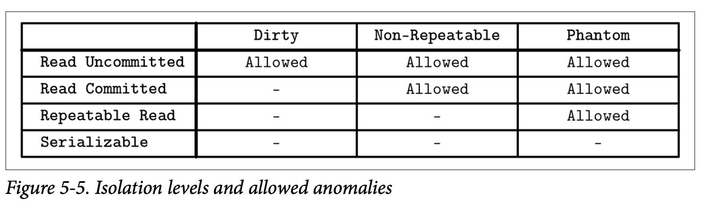
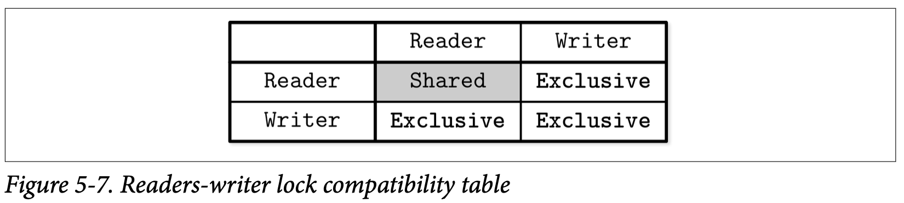
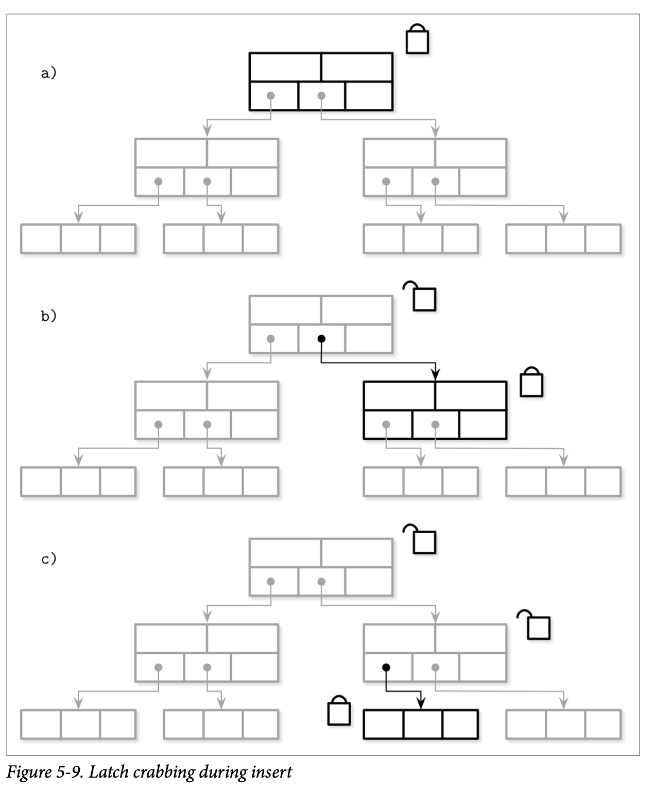

## Concurrenty Control

在讨论数据库管理系统的架构时，我们提到事务管理器跟锁管理器会一起来处理 *concurrenty control* 并发控制。并发控制是一系列用来处理并发执行事务的技术，这些技术可以粗略的归为下面的几个分类：

- *Optimistic concurrency control (OCC)*

  允许事务能够并发的执行读取跟写入操作，并确认他们合并执行的结果是否能够序列化。换个说法就是，事务之间不会互相堵塞，管理事务的操作日志，并在日志提交之前检查这些操作是否会产生冲突。如果执行的结果有冲突，其中一个冲突的日志则会被终止。

- *Multiversion concurrency control (MVCC)*

  通过支持记录拥有多个版本来确保在某个时刻里，数据库能够保持该视图的一致性。*MVCC* 能够使用验证的方式来实现，允许其中一个更新或事务的提交成功执行，同样他也可以使用类似有序时间戳的无锁的技术来实现，或者使用类似 *two-phase-locking* 的基于锁的技术来实现。

- *Pessimistic (also known as conservative) concurrency control (PCC)*

  有基于锁跟非锁定的保守方法，他之间的区别在于如何管理及授权共享的资源。基于锁的方法需要事务在数据库的记录上管理锁，在事务释放他的锁之前，防止其他的事务去修改被锁定的记录以及访问修改中的记录。非锁定的方法根据对未完成的事务的调度来管理读取跟写入的操作列表并限制他们的执行。悲观的调度会在多个事务互相等待对方的资源时产生死锁。

在本章中，我们关注节点本地的并发控制技术。在 Chapter 13 中，则会找到关于分布式事务的信息以及实现的方式。

在我们更深入的讨论并发控制前，我们需要定义一系列我们尝试去解决的问题，以及讨论事务的操作的重叠性跟重叠产生时的后果。

### Serializability

事务由对数据库状态的读取及写入操作以及业务逻辑*(对读取内容所做的转换)*组成。从数据库的角度看，计划是执行一组事务所需的一系列操作 *(就是跟数据库状态有交互的操作，比如读取、写入跟事务的提交跟中断)* 。在此之外其他的所有操作都被假设是不会产生副作用的 *换句话说就是不会对数据库的状态产生影响*。

计划在他所包含的来自所有事务的操作都完成后就可以视为成功了，一个正确执行的计划在逻辑上应该等同于原始的操作列表，但是出于优化的目的，他们可能被并行的执行，或是顺序会被重新排列。只要他们不会违反 *ACID* 属性以及能够得到与单独执行时相同的正确结果。

当计划中所有事务的执行都是独立的并且不会产生交叉执行的情况，我们称这个计划是串行的，即事务不会在他的上一个事务还未完成之前启动。跟多个事务交叉执行对比，串行的执行很容易去推测，但是只一个接一个的执行事务对系统的吞吐量跟性能都会有很大的影响。

我们需要找到一个跟串行执行一样能够保持正确性及简易性的并发执行事务操作的方法。我们将通过 *serializable* 可序列化的计划来达到这个目标，一个可序列化的计划跟串行计划处理相同事务集合需要产生相同的结果。换句话说，就是在同一个事务集合中，他产生的结果跟逐个执行这些事务的结果必须一样。Figure 5-4 展示了三个并行事务的六种可能的执行顺序。

### Transaction Isolation

事务型数据库系统允许多种不同的隔离级别，隔离级别定义了不同的事务之间如何以及什么时候是可见的。换句话说，隔离级别描述了不同并行事务之间的隔离程度，以及在执行中会遇到的各种类型的问题。

实现隔离性是有代价的：为了防止事务边界内的不完全执行或部分写入，我们需要额外的协调跟同步机制，这会对性能带来负面的冲击。

### Read and Write Anomalies

数据库标准描述了在多个事务并发执行时可能会带来的 *read anomalies* 读取问题：*dirty* 脏读、*nonrepeatable* 不可重复读、*phantom* 幻读。

*dirty read* 脏读是指事务能够读取到其他事务还未提交的数据，比如说，事务 T~1~ 更新了用户记录的地址字段，事务 T~2~ 在 T~1~ 提交前就读取到了新的地址。事务 T~1~ 之后终止跟回滚了他执行的结果，但是 T~2~ 已经读取到了这个新的、不会被提交的新的地址。

*nonrepeatable read* 不可重复读是指事务在对同一条记录进行多次读取会得到不同的结果。比如，事务 T~1~ 读取了一行记录，然后事务 T~2~ 修改并提交了这个记录，如果 T~1~ 这个时候再次读取了这个记录，那他就会得到更前一次读取不同的结果。

如果我们在事务中使用了区间读取 *(比如不是读取单条记录，而是读取某个区间内的记录)*，我们可能会遇到 *phantom records* 幻觉记录。*phantom read* 幻读就是当事务对同一区间的数据多次读取时，得到不同的结果，他跟不可重复读有点类似，但他是在区间查询的时候出现的。

同样的， *write anomalies* 写入问题也有类似的语义：*lost update* 更新丢失、*dirty write* 脏写、*write skew* 写倾斜。

*lost update* 更新丢失发生在事务 T~1~ 跟 T~2~ 同时更新同一个值 V 时。T~1~ 跟 T~2~  读取 V 的值，T~1~ 更新了 V 之后提交， 然后 T~2~ 更新了 V 之后提交。因为两个事务都不知道对方的存在，如果两个提交都被允许，那 T~1~ 提交的结果将被 T~2~ 的结果覆盖了，也就是 T~1~ 的更新丢失了。

*dirty write* 脏写发生在一个事务读取到了一个未提交的记录 *(比如，在脏读中所读取的记录)* 后，对他进行修改，然后提交。换种说法就是当事务的结果依赖于不会提交的记录时，就会发生脏写。

*write skew* 写倾斜发生的情形是，每个独立的事务都满足不变量，但当他们组合在一起的时候会破坏不变量。举例来说，事务 T~1~ 跟 T~2~ 修改两个账户记录 A~1~ 跟 A~2~ ，A~1~ 一开始有 100 美元，A~2~ 一开始有 150 美元，只要两个账户的总和不为负数，就能允许其中一个账户是负数，即 $A_1 + A_2 >= 0$ 。现在 T~1~ 跟 T~2~ 都尝试从 A~1~ 跟 A~2~ 中提取 250 美元，250 美元是满足总金额这个要求的，因此每个事务都假设自己满足当前不变量可以进行提交。在提交后 A~1~ 变成了 -100 美元，A~2~ 则变成了 -50 美元，这时就很明显的违反了保持账户总额不能为负数的这个要求。

### Isolation Levels

隔离级别中级别最低 *(隔离性最弱)* 的是 *read uncommitted* **读未提**交，在这个隔离级别中，事务系统允许事务观察到其他事务所作的但未提交的修改，换句话说就是允许出现脏读。

我们是可以避免部分的异常的，比如说我们可以保证事务中的每个读取操作都只能读到已经提交的更改。但是，这并不能保证这个事务在稍后重新读取这个值的时候还能够读取到同样的值。如果在这两次读取之间有其他的事务做了修改，那同一个事务中的两次读取就会得到两个不同的结果。换句话说就是不允许脏读，但是允许幻读跟不可重复读。这个隔离级别称为 *read committed* **读已提交**。如果我们需要把不可重复读也禁止，那就是另外一个称为 *repeatable read* **可重复读**的隔离级别了。

最强的隔离级别叫做 *serializability* **可序列化**，跟我们在之前已经讨论的一样，他保证了事务执行的会以他们启动的顺序逐个产生，只是禁止事务并发执行会对数据库的性能带来较大的负面影响。事务可以在位置其内部不变量的前提下进行重排序，但他们的结果一样需要以串行一样的顺序出现。

Figure 5-5 展示了隔离级别以及他们允许出现的问题

没有任何依赖的事务可以以任意的顺序来执行，因为他们所产生的结果也是完全独立。不像 *linearizability*  *(我们会在分布式系统中讨论)*，*serializability* 可序列化属性表示允许多个操作以任意的顺序来执行，他不隐含或尝试去限制执行中的事务以特定的顺序执行。*ACID* 中的 *Isolation* 隔离性就表示了可序列化。但是要实现可序列化就意味着需要进行协调，换句话说，并行执行需要通过协调来保证他们的不变量以及为有冲突的的操作保持其执行顺序。

有些数据库也会使用 *snapshot isolation* 快照隔离，在快照隔离中，事务能够观察到从他开始执行那一刻起，所有其他已提交事务的变更状态，每个事务都会以这个快照的数据为基础去执行自己的查询，并且这个快照在事务执行的过程中是不能够改变的。最后事务只会在他所修改的值没有被其他事务修改时才能够提交，否则的话他会被终止并且回滚。

如果有两个事务尝试去修改同一个值，那只有其中一个是允许提交的，这就能够排除掉 *lost update* 更新丢失的问题了。比如，事务 T~1~ 跟 T~2~ 都尝试去修改 V，他们会先去从所有在他启动之前已经提交的事务里去读取 V 现在的值，然后只要有一个事务首先执行了提交，那他就会提交成功，并且所有其他的事务都会被中断。这时其他失败的事务不会覆盖掉这个值，而是会重新进行尝试。

*write skew* 写倾斜的问题在快照隔离级别中依然可能存在，因为事务可以读取本地的状态，然后修改独立的数据记录，保持他局部的不变量，这样他们就都能够成功提交。在后续的分布式事务章节中我们会在继续讨论快照隔离的更多细节。

### Optimistic Concurrency Control

乐观的并发控制假设事务的冲突是很少见的，并且不会使用锁跟堵塞事务的执行，我们可以通过对并行执行的事务进行检验来防止他们产生读或写的冲突，只要在事务提交之前确保他们是可序列化的。通常来说，事务会被分成三个步骤

- *Read phase*

  事务执行他内部上下文中的步骤，而无需去关注其他事务的可见性，在这之后，事务的依赖信息 *(读取集合)* 是可以确认的，以及事务所产生的副作用 *(写入集合)* 也是可以确认的

- *Validation phase*

  通过对并行事务的读取集合跟写入集合进行检查就可以知道他们之间是否违反了可序列化性质。如果其中某些事务所读取的某些数据已经过期，或者在他的读取步骤中这些数据会被其他已提交的事务修改，那他的内部上下文会被清空并且他的读取步骤会被重新执行。换句话说，检查步骤确认事务是否会违反 *ACID* 属性

- *Write phase*

  如果验证步骤确认了不存在冲突，则事务可以将他内部上下文中的写入集合提交到数据库中。

检验可以通过检查已提交事务之间 *(反向的检查)* 或是处于检验步骤之间  *(正向的检查)* 事务的冲突来完成。不同事务的检验跟写入步骤应该是原子性的。在对其他事务进行检验时不允许任何事务的提交，因为检验跟写入步骤对比读取步骤来说通常耗时是非常短的，因此这点是可以接受的。

反向的并发控制确保任意一对事务 T~1~ 跟 T~2~ 能够保持下面的属性

- T~1~ 在 T~2~ 的读取步骤之前提交，则 T~2~ 可以提交
- T~1~ 在 T~2~ 的写入步骤提交了，并且 T~1~ 的写入集合跟 T~2~ 的读取集合没有交集，换句话说， T~1~ 没有写入任何 T~2~ 需要看到的值
- T~1~ 的读取步骤在 T~2~ 的读取步骤之前完成，并且 T~2~ 的写入集合跟 T~1~ 的读取集合没有交集。换句话说，事务之间没有对共同的数据进行操作，则两个事务都可以提交

这种方式在验证成功率较高、事务无需进行重试的情况下是高效的，因为重试对性能会造成较大的负面影响。当然，乐观的并发还有一个 *critical section* 关键部分，就是在同一个时刻只有一个事务进行。另一种允许执行一些非排他性操作的方式是使用 *readers-writer locks* 读写锁 *(即并发读取访问)* 跟 *upgradeable locks* 可升级锁 *(为了允许将共享锁升级为排他锁)*。

### Multiversion Concurrency Control

*Multiversion concurrency control* 多版本并发控制允许数据记录有多个版本并使用单调递增的事务 ID 或时间戳来标识版本，并以此来实现数据库管理系统的事务一致性。这允许读跟写在存储级别只需要最小化的协调，因为在新版本被提交之后仍然可以读取到之前的旧值。

*MVCC* 将 *committed* 已提交跟 *uncommitted* 未提交的版本区分开来，这能为已经提交跟未提交的事务找到对应的值。该值最后提交的版本被假定为 *current* 当前版本。通常，事务管理器的目标是保证在同一个时刻最多只有一个未提交的值。

数据库系统隔离级别的实现，决定了读操作能够或不能够去访问一个未提交的值，可以使用锁、调度跟冲突解决技术 *(比如 two-phase locking)* 或时间戳排序来实现多版本并发。*MVCC* 的其中一个主要使用案例就是用来实现快照隔离。

### Pesimistic Concurrency Control

悲观的并发控制方案比乐观的要保守的多，这些方案在加锁在事务执行的时候检查冲突并阻止或中断事务的运行。

其中一个简单的悲观 *(lock-free)* 并发控制方案是使用 *stimestamp ordering* 时间戳顺序，他让每个事务都持有一个时间戳，然后事务中的操作能否继续执行则是取决于当前是否已经有持有更早时间戳的事务已经被提交了。为了实现这个方案，事务管理器需要独立维护 *max_read_timestamp* 跟 *max_write_timestamp* ，他们描述了并发事务中当前已经执行的读取跟写入操作。

当有事务尝试使用小于 *max_read_timestamp* 的时间戳去执行读取操作会导致该事务被中断，因为这里已经有比他还新的值存在了，这时允许他继续执行的话会违反了事务的执行顺序。

类似的，当有事务使用小于 *max_read_timestamp* 的时间戳去执行写入操作时会跟当前的读产生冲突。但是使用小于 *max_write_timestamp* 的时间戳去执行写入操作是允许的，因为我们可以安全的忽略已经写入的过期的值。这个推测的方式被称为 *Thomas Write Rule*。在读取跟写入操作执行的同时，他们对应的最大时间戳会被更新，接着被中断的事务会带着更新后的时间戳进行重试，否则的话他们也只会被再次中断。

### Lock-Based Concurrency Control

基于锁的并发控制方式是悲观并发控制的一种，他在数据库对象上使用明确的锁，而不是通过使用类似时间戳排序等机制来解决调度问题，但是使用锁的方式也会带来竞争跟扩展性的问题。

其中一个使用得最广泛的基于锁的技术是 *two-phase locking* 两阶段加锁，他将锁的管理拆分成两个步骤：

- *growing phase* 增长阶段 *(也叫做 expanding phase 扩展阶段)* 收集以及对所有事务所需的锁进行加锁，并且不会释放任何一个锁
- *shrinking phase* 收缩阶段，释放所有在增长阶段收集到的锁。

根据上面两个定义能够得到一个规则，就是事务一旦释放了一个锁，就无法在获得其他的任何锁了。一个务必要记住的事情是 2PL 在上述的任何一个阶段中都不会排除事务的执行，但是有一些 2PL 的变种 *(比如 conservative 保守的 2PL)* 会强制执行这个限制。

> 尽管有着类似的名字 *two-phase locking* 跟 *two-phase commit* 的锁定概念是完全不同的。*Two-phase commit* 是一个用在分布式的多个分区事务的协议。而 *Two-phase locking* 是一个用来实现可序列化的并发控制机制。

#### Deadlocks

在锁定协议中，事务会尝试去获取数据库对象上的锁，并在没办法获取到锁时会一直等待直到锁被释放。这里有一种情况，有两个事务为了能够继续执行，会尝试去获取他们所需的锁，最后他们互相在等着对方释放他们所持有的锁，这种情况我们称为 *deadlock* 死锁。

*Figure 5-6* 展示了一个死锁的例子，T~1~ 持有锁 L~1~ 并在等待锁 L~2~ ，事务 T~2~ 只有锁 L~2~ 并在等待锁 L~1~。

处理死锁最简单的方式是给一个超时时间，并假设那些运行了较长时间的事务是因为遇到死锁。另一个策略是使用 *Conservative 2PL* 保守的二阶段锁，他要求事务在他们执行自己的任何操作前先获取所有的锁，并在获取不到的时候中断。然而这些方法极大的限制了系统的并发性，数据库系统大部分会使用事务管理器来检测跟避免死锁的发生。

对死锁的检测一般会通过 *waits-for graph* 等待图，他被用来跟踪正在执行的事务之间的关系，然后在等待图中建立他们的连接。

在图中产生了环就说明这些事务之间会产生死锁：比如事务 T~1~ 等待着  T~2~ ，同时 T~2~  也在等待着 T~1~。死锁可以通过周期性 *(定时)* 的或持续性 *(每次图更新时)* 对等待图进行检查来发现，然后其中的一个事务 *(通常是那个正在尝试加锁的)* 会被中断。

为了避免死锁跟让获取锁的操作不会导致出现死锁，事务管理器可以使用事务的时间戳来确定他们之间的优先级。更低的时间戳通常来说会具有更高的优先级。

如果事务 T~1~ 尝试去获取一个现在被事务 T~2~ 持有的锁，并且 T~1~ 具有更好的优先级 *(即他在 T~2~ 之前启动)* ，我们可以使用下面的限制来避免死锁：

- *Wait-die*

  T~1~ 允许堵塞跟等待对应的锁，否则， T~1~ 会被中断然后重启。话句话说，一个事务只有具有较大的时间戳的事务才可以被堵塞

- *Wound-wait*

  T~2~ 被中断然后重启 *(T~1~ 伤害了 T~2~)* ，否则 *(如果 T~2~ 在 T~1~ 之前启动)*  T~1~ 会被允许进行等待。换句话说，事务只有在具有较低的时间戳时才可以被堵塞。

事务的执行需要调度器来处理死锁的情况，与此同时 ,*latches* 锁存器则依赖编程人员来确保不会发生死锁，并且不会依赖于用于避免死锁的机制。

#### Locks

如果两个事务被并发的提交了，他们之间修改的数据有重叠的部分，那他们两个都不应该观察到另一个事务的部分结果，从而保持逻辑上的一致性。类似的，在同一个事务中的两个线程需要能够观察到同样的数据内容，并且能够访问到对方的数据。

在事务的执行中，数据逻辑上的一致性跟物理上的一致性是具有不同语义的，有两个负责逻辑跟物理一致性的对应的概念分别是 *locks* 锁跟 *laches* 锁存器。他的命名让人有点失望，因为着这里我们称为锁存器的东西在系统编程中通常称为锁，但我们会在这一节来说清楚他们之间的区别跟暗示。

锁被用来实现隔离性、调度重叠的事务跟管理数据库内容，但不会用于内部的存储结构，最后会使用对应的 Key 来获取。锁可以用来保护指定的 Key *(不管是存在还是不存在)* 跟区间范围的 Key。锁通常会在树的实现之外跟表示更高层级的概念，他会有数据库锁管理器来进行管理。

锁相对于锁存器会比较重量级一些，并且他会在整个事务的执行过程中被持有。

#### Latches

另一个角度，锁存器用来保护树在物理上的表现形式：叶子节点的内容会在插入、更新或删除操作中被修改；非叶子节点的内容跟树的结构会在导致叶子节点因为上溢或下溢导致的分裂跟合并的操作时被修改。锁存器在这些操作发生时获取页的层级，来保护树的物理表现形式 *(页的内容跟树的结构)* 。任何页都需要通过上锁上来保证能够进行安全的并发访问。无锁的并发控制技术都会用到锁存器。

因为在 B-Tree 叶子层级的单个修改可能会传递到更高的层级，所以可能需要同时在多个层级获取锁存器。执行查询不能够读取到页的不一致状态，比如因为部分写入或者部分节点的分裂时，数据可能会同时存在源页或目标页中，或是数据还未被传递到父节点。

我们用同样的规则来应用父节点或是邻接节点的更新，其中最通用的规则就是要最小化页被读取或更新时对应锁存器的持有时间，来提高并发能力。

并发操作之间的互相干扰大致可以分成下面三类：

- *Concurrent reads* 并发读，多个线程同时访问同一个页，并且不会对其做出修改
- *Concurrent updates* 并发写，多个线程尝试对同一个页进行修改
- *Reading while writing*  读取时写入，有一个线程在尝试修改某个页的同时，另一个线程尝试去读取该页

这些场景也适用于数据库管理系统对数据进行维护时的重叠访问 *(比如在 Vacuum and Maintenance 中的后台处理器) *。

#### Readers-writer lock

最简单的锁存器实现是为每个请求的线程的给予排他的读取或写入权限。但是，在大部分情况下，我们不需要将所有的操作都互相隔离开，比如并发的读取页并不会造成任何问题，因此我们需要保证的是多个并发的 *writers* 写入之间不会产生重叠，以及 *readers* 读取跟写入之间也不会产生重叠。为了实现这个级别的保障，我们可以使用 *readers-writer lock* 读取者-写入者锁或是 *RW lock* 读写锁。

读写锁允许多个并发的读取访问，以及只有一个写入 *(一般是少量的)* 会能够排他的访问目标对象。Figure 5-7 展示了完整的读写锁信息：只有读取能够共享该锁的所有权，其他的读取跟写入的组合都会产生排他性。

在 Figure 5-8 (a) 中，我们有多个读取者访问目标对象，这次写入者将会进行等待，并且在读取者访问期间他不能够修改该页的内容。在 Figure 5-8 (b) 中，写入者 1 持有了目标对象上的排他锁，因此其他的写入者跟三个读取者都需要进行等待。

因为两个重叠的读取同一个页的操作不需要同步，只需要防止页缓存多次尝试从磁盘中将它读取到内存即可。因此读取操作可以安全的以共享模式被并发的访问。只有当写入操作发生时，我们才需要将他与其他并发的读取跟其他的写入进行隔离。

> #### Busy-Wait and Queueing Techniques
>
> 为了对页的共享访问进行管理，我们可以使用基于堵塞的算法，如当可以继续推进操作时唤醒等待的线程；也可以使用基于 *busy-wait* 忙等算法，忙等算法允许线程进行短暂的等待，而不是直接把控制权交回给调度器。
>
> 队列通常会使用 *compare-and-swap* 指令来实现，他能够保证锁的获取跟队列的更新的原子性。如果队列是空的，则当前线程能够直接对他进行访问，否则的话，线程将自己加入等待的队列中,然后在某个只能由当前正在处理队列线程处理的变量上进行自旋。这种方式能够减少 CPU 在加锁跟释放锁上的开销。

#### Latch crabbing

实现 Latch 最直接的方式就是在为从树的根一直下降到叶子路径上的所有节点都加上锁。但这会对并发产生瓶颈，但是在大部分的情形中这是可以避免的，我们要尽量最小化持有 Latch 的时间。其中有一种优化的方式称为 latch crabbing。

*Latch crabbing* 是一种相当简单的方式，他能够减少持有 *Latch* 的时间，并在所执行的操作不需要 *Latch* 时尽可能快的对其进行释放。在读取路径中，在一个节点的子节点定位成功时，其父节点所持有的 *Latch* 就会马上被释放。

在插入时，只要确认当前节点的操作不会造成树的结构产生影响就可以马上释放其父节点的 *Latch*，换句话说，父节点的 *Latch* 在其子节点不满时就能够释放。

类似的，在删除时，如果子节点仍持有足够的元素，而不会导致节点合并发生的话，父节点的 *Latch* 也可以被释放。

Figure 5-9 展示了插入时从根到叶子节点的传递过程

- a) 写操作会对根节点进行加锁
- b) 下一级的节点被定位后，他的 *Latch* 也会被获取，然后检查该节点是否有可能发生结构性的变化，即该节点是非满的，那他的父节点就能够被释放了
- c) 操作下降到下一个层级，写入的 *Latch* 会被获取，检查目标的叶子节点是否有可能发生结构性的变化，没有的话就释放其父节点的锁

这个一种乐观的实现方式：假设大部分的插入跟删除操作不会导致数据结构的变更传播到多个层级。事实上，在越高的层级中结构发生变更的概率就月底。大部分的操作只需要获取目标节点的 Latch，同时需要保存期父节点 Latch 的情形相对较少。

如果子页还未被页缓存读取，我们也可以对即将被加载的页先加锁，或者释放父节点的锁，在该页被加载进内存后再从根节点重新下降来减少竟态条件。重新启动从根节点到叶子节点的下降过程听起来很昂贵，但事实上我们很少会执行这样的操作，而且也可以使用其他的检测机制，实现在访问更高层级节点就知道哪些结构会发生改变。

> Latch Upgrading and Pointer Chasing
>
> 相对于在遍历的过程中马上对节点进行加锁，而是对 Latch 进行升级的方式实现。这种方式需要所在查找路径时能够共享，并在需要的时候能够升级为排他的。
>
> 写入操作首先只会在叶子级别获取排他锁，如果叶子需要进行分裂或合并，则该算法会沿着树的节点向上遍历并尝试将父节点持有的共享锁升级为排他锁来保护树的结构 *(也就是父节点也可能会因为该操作导致分裂或合并)*。因为多个线程可能会同时在高层级的同一个节点上尝试升级锁，当冲突产生时他们其中的一些操作需要进行等待或是重启。
>
> 你也许发现了这个机制所有对 Latch 的获取都是从根节点开始的，所有的请求都会通过根节点，因此他很快会称为瓶颈。与此同时，根节点总是最后才会被分裂的，因为他所有的子节点需要都被填满先，这意味着根节点总是可以以乐观的方式对待，因为重试的代价是很小的。

#### Blink-Trees

B^link^-Trees 在 B^*^-Trees 之上添加了 *hight keys* 跟 *sibling link* 指针。*High key* 指明了子树中的最大的 Key，B^link^-Tree 中除了根以外的节点都有两个指针：父节点用于指向子节点的指针及左节点指向其下一个同级节点的指针。

B^link^-Tree 允许一种称为 *half-split* 的状态，他指一个节点被他相邻的节点引用了，但没有父节点是指向他的。*Half-split* 可以通过 *high key* 来进行识别，如果查找的 *key* 超过了该节点的 *high key* *(这表示违反了 high key 的不变形)*，查找算法就能够推断出该结构已经被并发的进行了修改，然后继续在他的下一个相邻节点中进行查找。

为了得到最佳的性能，指针需要能够快速的被添加到他的父节点中，但查找的过程不会因此被中断跟中期，因为此时树中所有的元素依然能够进行访问。这种方式的优点是在访问子节点时无需持有父节点的锁，尽管子节点可能马上会被分裂：我们可以创建一个新的节点并将其链接到兄弟节点中，并在不影响正确性的前提下惰性的更新其父节点的指针。

这种方式相对于直接从父节点访问会有轻微的性能影响，因为他需要访问额外的页，同时也导致在根到叶子节点的遍历保持正确性的前提下简化了并发的访问。因为分裂相对来说是比较少见的，并且 B-Tree 也很少会进行收缩，因此这是一个例外的场景并且他的代价也是非常微小的。这种方式也有一些优点：他减少了锁的竞争，避免在分裂时持有父节点的锁，减少了树结构在发生变化时所需的锁的数量。最重要的是，他允许在树结构发生变化的同时进行并发的读取，还能够防止并发的修改中因为操作上升到同一个父节点产生的死锁。

### Summary

在这章中我们讨论了存储引擎组件在事务处理跟恢复的职责。在实现事务处理中，我们遇到了两个问题：

- 为了提高效率，我们需要允许并发的事务执行
- 为了保证正确性，我们需要确保并发执行的事务符合  ACID 属性

并发事务的执行会导致各种不同类型的读写异常，可以通过实现不同的隔离级别来限制或允许这些异常的存在。并发的控制方式取决于了事务的调度跟执行方式。

页缓存被用于减少对磁盘的访问：他将页缓存到内存中，并允许对其进行读取跟写入操作。当缓存触及到他容量上限时，页会被驱逐出缓存并写入磁盘。为了保证未写入磁盘的变更在节点崩溃时不会丢失，及支持事务的回滚，我们使用了预写日志 *Write-ahead logs*。使用 force 跟 steal 策略来管理页缓存跟预写日志，保证了事务可以在不牺牲持久性的前提下高效的执行跟回滚。

> #### Further Reading
>
> If you’d like to learn more about the concepts mentioned in this chapter, you can refer to the following sources:
>
> - Transaction processing and recovery, generally
>
>   ​	Weikum, Gerhard, and Gottfried Vossen. 2001. Transactional Information Sys‐ tems: 	Theory, Algorithms, and the Practice of Concurrency Control and Recovery. San Francisco: Morgan Kaufmann Publishers Inc.
>
>   Bernstein, Philip A. and Eric Newcomer. 2009. Principles of Transaction Process‐ ing. San Francisco: Morgan Kaufmann.
>
>   Graefe, Goetz, Guy, Wey & Sauer, Caetano. 2016. “Instant Recovery with Write- Ahead Logging: Page Repair, System Restart, Media Restore, and System Failover, (2nd Ed.)” in Synthesis Lectures on Data Management 8, 1-113. 10.2200/ S00710ED2V01Y201603DTM044.
>
>   Mohan, C., Don Haderle, Bruce Lindsay, Hamid Pirahesh, and Peter Schwarz. 1992. “ARIES: a transaction recovery method supporting fine-granularity locking and partial rollbacks using write-ahead logging.” Transactions on Database Sys‐ tems 17, no. 1 (March): 94-162. https://doi.org/10.1145/128765.128770.
>
> - Concurrency control in B-Trees
>
>   Wang, Paul. 1991. “An In-Depth Analysis of Concurrent B-Tree Algorithms.” MIT Technical Report. https://apps.dtic.mil/dtic/tr/fulltext/u2/a232287.pdf.
>
>   Goetz Graefe. 2010. A survey of B-tree locking techniques. ACM Trans. Database Syst. 35, 3, Article 16 (July 2010), 26 pages.
>
> - Parallel and concurrent data structures
>
>   McKenney, Paul E. 2012. “Is Parallel Programming Hard, And, If So,What Can You Do About It?” https://arxiv.org/abs/1701.00854.
>
>   Herlihy, Maurice and Nir Shavit. 2012. The Art of Multiprocessor Programming, Revised Reprint (1st Ed.). San Francisco: Morgan Kaufmann.
>
> - Chronological developments in the field of transaction processing
>
>   Diaconu, Cristian, Craig Freedman, Erik Ismert, Per-Åke Larson, Pravin Mittal, Ryan Stonecipher, Nitin Verma, and Mike Zwilling. 2013. “Hekaton: SQL Server’s Memory-Optimized OLTP Engine.” In Proceedings of the 2013 ACM SIGMOD International Conference on Management of Data (SIGMOD ’13), 1243-1254. New York: Association for Computing Machinery. https://doi.org/ 10.1145/2463676.2463710.
>
>   Kimura, Hideaki. 2015. “FOEDUS: OLTP Engine for a Thousand Cores and NVRAM.” In Proceedings of the 2015 ACM SIGMOD International Conference on Summary | 109Management of Data (SIGMOD ’15), 691-706. https://doi.org/ 10.1145/2723372.2746480.
>
>   Yu, Xiangyao, Andrew Pavlo, Daniel Sanchez, and Srinivas Devadas. 2016. “Tic‐ Toc: Time Traveling Optimistic Concurrency Control.” In Proceedings of the 2016 International Conference on Management of Data (SIGMOD ’16), 1629-1642. https://doi.org/10.1145/2882903.2882935.
>
>   Kim, Kangnyeon, Tianzheng Wang, Ryan Johnson, and Ippokratis Pandis. 2016. “ERMIA: Fast Memory-Optimized Database System for Heterogeneous Work‐ loads.” In Proceedings of the 2016 International Conference on Management of Data (SIGMOD ’16), 1675-1687. https://doi.org/10.1145/2882903.2882905.
>
>   Lim, Hyeontaek, Michael Kaminsky, and David G. Andersen. 2017. “Cicada: Dependably Fast Multi-Core In-Memory Transactions.” In Proceedings of the 2017 ACM International Conference on Management of Data (SIGMOD ’17), 21-35. https://doi.org/10.1145/3035918.3064015.

