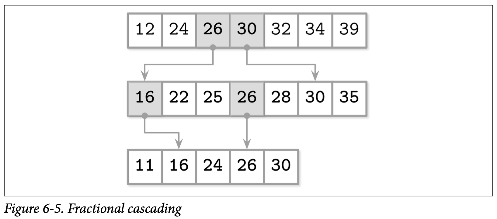

## FD-Trees

缓存是一个被广泛使用在数据库存储中的做法：他能够避免许多的随机写操作，将他们合并成一个较大的写操作。在 HDD 硬盘中，随机的写入因为需要进行磁头定位，因此是非常慢的。在 SSD 硬盘中，虽然不存在移动的操作了，但过多的 I/O 写入也会带来额外的垃圾回收问题。

维护 B-Tree 需要许多的随机写入操作，比如叶子级别的写入、分裂以及传递到上级节点的合并操作，但是我们是否能够避免随机写入并让节点能够一起进行更新呢？

一直到现在我们讨论的都是缓存针对单独的节点或者是对多个节点组成的分组进行更新，另一种替代的方案是将不同节点的更新集中到一起，然后使用只添加的存储引擎来处理合并操作，这个想法是从 LSM Tree 中来的。这意味着所有的写操作现在都不需要去定位目标节点了：所有的更新都只要简单的添加到末端。有一个在索引中使用了这种方式的例子是 *Flash Disk Tree (FD-Tree)*。

FD-Tree 包含了一个小型的可变 *head tree* 以及多个不可变的有序对象。这个方式将随机写限制到了 *head tree* 上：他是一个小型的缓存了修改操作的 B-Tree ，在 *head tree* 填满时，他的内容会被转换成不可变的 *run*。如果最近写入的尺寸超过了指定的阈值，则他的内容会被合并到下一个级别，因此数据记录是从较高的级别逐渐传递到较低的级别。

### Fractional Cascading

为了维护不同级别间的指针，FD-Tree 使用了一种称为 *fractional cascading* 的技术。这个方式能够帮助我们减少在级联的有序数组中定位元素的开销：你会使用 $log_2n$ 步来从第一个数组中查找目标元素，但是后续的查找成本会显著的降低，因为他会从最接近于上一个层级的地方开始查找。

我们通过为相邻层级的数组之间建立 *bridges* 来作为层级之间的捷径，用这个捷径来最小化数组之间的空白：元素组没有来自更高层级的指针，*Bridges* 则是使用从较低级别中的元素 *pulling* 拉到较高级别的方式来构建的，如果他们不存在于更高级别中，则会在较高级别对应的位置中建立指向较低级别中被拉取元素的指针。

解决描述在 *bidirecional briders* 中几何学的搜索问题及用于恢复 gap 大小不变性部分将不会在这里进行讨论，我们描述的只有应用层面上的数据存储跟 FD-Tree 相关的部分。

我们可以创建一个为每个高层级数组中的元素创建一个关联到下一个层级的映射，但这会导致高昂指针及维护他们的代价。如果我们只对已经存在于较高高层级的元素建立映射，我们最终可能会需要面对元素之间间隙太大的问题。为了解决这个问题，我们将较低层级中的每第 Nth 个元素拉到上一个层级。

比如，如果我们有多个有序的数组

```python
A1 = [12, 24, 32, 34, 39]
A2 = [22, 25, 28, 30, 35]
A3 = [11, 16, 24, 26, 30]
```

我们可以将每个在自己数组中的位置，向上拉取后会变得具有更低位置的元素建立 *bridge* 来简化查找，比如上述的数组可以变成

```python
A1 = [12, 24, 25, 30, 32, 34, 39]
A2 = [16, 22, 25, 26, 28, 30, 35]
A3 = [11, 16, 24, 26, 30]
```

现在我们可以使用这些拉上来的元素来创建数组间的 *birdge* 了 *(或者是像 FD-Tree 论文中叫做 fence)*：从高层级元素的指针指向低层级的元素。如 Figure 6-5 所示



为了在所有的数组中找到指定的元素，我们首先从最高层级的数组中使用二叉查找，接着往下层查找时所需的查找空间就会减少，因为我们现在可以通过 *bridge* 进入尽量靠近目标元素的位置开始查找。这让我们将多个有序的数组连接了起来，并以此减少了查找所需的代价。

### Logarithmic Runs

FD-Tree 将按照对数尺寸创建的有序数组叠加了起来：不同层级间的不可变的有序数组之间使用 K 作为增长因子，在创建的时候，会合并上一个层级到当前的层级。

最高层级会在 *head tree* 填满的时候创建：他的叶子的内容会被写到第一个层级中。当 *head tree* 再次被填满时，他的内容会跟第一个层级进行合并，合并之后的结果会替换掉上一个创建的版本。下一个层级会在当前层级的尺寸达到指定阈值的时候创建。如果较低的层级已经存在，那他的内容会跟较高层级的内容进行合并，然后被替换掉。这个处理的过程跟 LSM Tree 的压缩非常的相似，不可变的 Table 会被合并并创建一个更大的 Table。

Figure 6-6 展示了 FD-Tree 的大致形态，head B-Tree 在顶端，两个对数的层级是 L1 跟 L2，并且他们之间已经建立好了 *bridges*。


为了保持所有有序层级中的元素都是可定位的，FD-Tree 使用分数级联的调整版本，即较低层级的头部元素会被作为指针传递到较高层级中。使用这些指针可以减少较低层级的查找开销，因为查找已经在较高的层级完成了一部分，因此在较低层级中可以在更可能命中的范围中进行。

因为 FD-Tree 并不会在就地更新页的内容，所以可能会出现同一条数据记录在多个层级中出现，FD-Tree 通过在插入墓碑元素 *(在论文中称为 filter entries)* 来表示跟该 Key 关联的数据记录已经被删除了，因此在所有较低层级的查找中该 Key 都会被直接丢弃。当墓碑元素被传递到了最低层级时，这个 Key 就可以被丢弃了，因为已经不会再有他的影子元素了。


