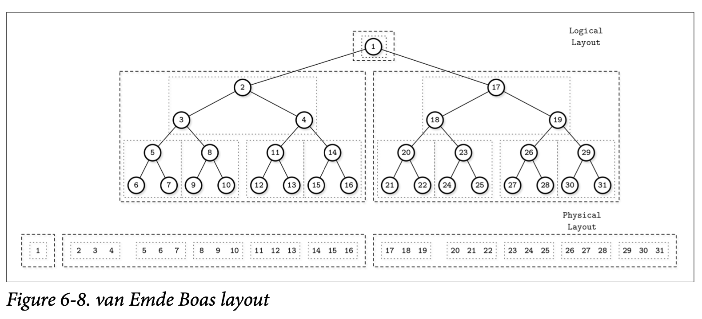

## Cache-Oblivious B-Trees

块尺寸、节点尺寸、缓存行的对齐还有其他的各种配置参数都会影响 B-Tree 的性能，有一种新型的称为 *Cache-Oblivious Structures* 缓存无关的数据结构能够在无需了解底层的内存层次结构跟这些配置参数的前提下渐进式的对性能进行优化。这意味着这个算法无需去了解缓存行的大小，文件系统的块信息跟磁盘的页信息。缓存无关的数据结构设计的目标就是，在多台机器中使用也无需进行为他们进行各种不同的配置。

到现在为止我们大部分关注点都是 *two-level memory hierarchy* 两层内存结构的 B-Tree 实现 *(除了 LMDB)*。B-Tree 的节点会被存储在基于磁盘的页中，并且为了能够进行高效的访问会将页缓存到内存中。

这里说的两个层级分别指的是页缓存 *(快速，但有空间限制)* 跟磁盘 *(通常会慢一些，但具有更大的容量)*。在这里我们只有两个参数，因此让算法的设计变得比较简单，因为我们只需要关注两个特定层级的代码模块，跟这两个模块中的细节。

磁盘的信息会被拆分成一系列的块，并且数据在磁盘跟缓存中的传输也是基于块的：尽管算法可能只需要定位到块中某个独立的元素，也需要对整个块进行加载。这种方式叫做 *cache-aware* 缓存感知。

当开发一个性能关键的软件时，我们通常会使用更复杂的编程模型，需要去考虑 CPU 缓存，以及其他磁盘架构之类的信息 *(如冷热存储或 HDD/zSD/NVM 等存储类型，以及数据各层级间的传输)*。大部分时候这种努力的成果很能去把他按通用化。在 *Memory- Versus Disk-Based DBMS* 中，我们讨论了访问磁盘相对于访问内存存在巨大的速度差，这也是为什么数据库的实现一直想在这个差异中来实现优化的原因。

缓存无关的算法根据两层内存模型对数据结构进行分析，来自动提供多层级结构模型的优点。这个做法让我们能够不需用跟平台相关的参数，并仍然能够保证两个不同层级之间的数据传输次数仍会保持在一个常量因子以内。如果数据结构已经为任意的两层内存的结构做了优化，那他在两个相邻的层级结构里也一样能够得到优化的效果。这种优化是通过尽量让操作都集中在更高层级上来完成的。

### van Emde Boas Layout

一个缓存无关的 B-Tree 有一个静态的 B-Tree 跟一系列数据结构组成，静态的 B-Tree 使用 *van Emde Boas* 布局来构建，他中间层的边缘将树进行了切分，然后每个子树按照同样的方式进行切分，知道子树大小变为 $sqr(N)$ 。这里面的想法是任意一颗递归的树都可以存储在连续的内存块中。

在 Figure 6-8 中，你可以看到一个 *van Emde Boas* 布局的示例，按照逻辑进行分组的节点会被紧靠着的放置到一起。在顶层，你可以看到逻辑布局的表现形式 *(如节点是如何形成一棵树的)*，在下面则可以看到树的这些节点是如何在磁盘上布局的。

为了让数据结构具有动态性 *(比如能够进行插入、更新跟删除)*，缓存无关的树使用称为 *packed array*  压缩数组的数据结构，他使用了连续的内存段来存储元素，但是预留了一些空隙用来存储未来可能存储的元素。空隙则按照 *density threashold*  密度的阈值来放置， Figure 6-9 展示了压缩数组的结构， 元素们被放置到了已经创建好的空隙中。

这个方式允许在插入元素到树时只需要少量的重新定位。元素只有在需要创建新的空隙来存放新插入元素的时候才进行重新定位。当一个压缩数组变得越来越紧凑或者是足够稀疏时，这个结构就需要进行重建来进行扩展或是收缩了。

静态树会被用来作为底层压缩数组的索引，并在重定位元素时需要对其进行更新来确保指向正确的底层元素。

这是一个有趣的方式，从这个方式中产生的想法可以被用来实现高效的 B-Tree，他让我们可以使用类似在构建内存一般的方式来构建基于磁盘的数据结构。但是在写这本书的时候，还没有发现有任何非学术的缓存无关 B-Tree 的实现。

假设原因可能是当缓存加载被抽象之后，数据在从块中读取或被写入块的时候，页的加载跟驱逐依然会造成负面的影响。另一个可能的原因是就块的传输而言，对缓存无感知的 B-Tree 的复杂度跟缓存感知的差不多。这种情况可能会在更高效的非易失性字节存储设备变得更普遍时有所改变。

