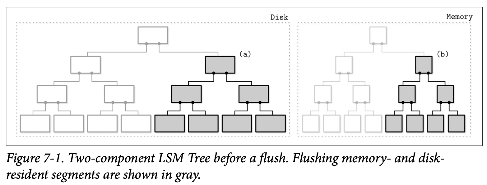
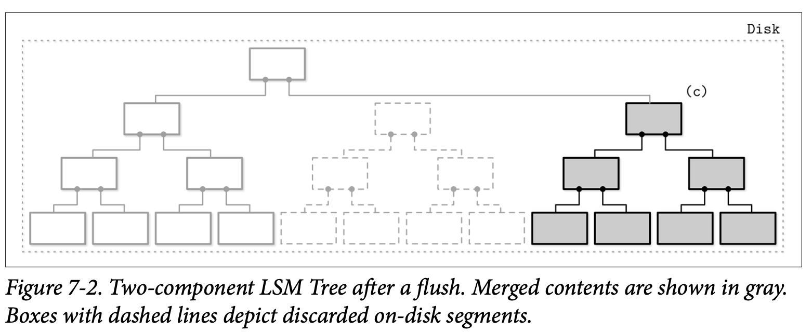
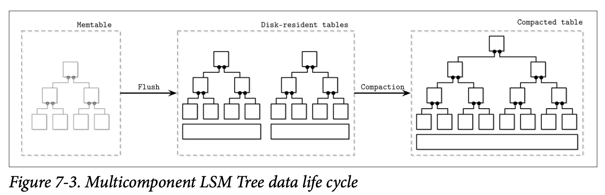
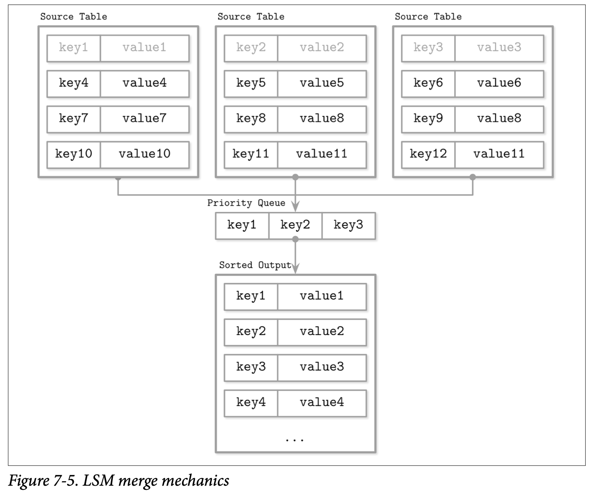

# LSM Trees

在讨论 B-Tree 时我们总结了可以通过加入缓冲来对空间过载及写放大问题进行优化。通常来说有两种应用缓冲的方式：延后传递写入的操作到磁盘页中 *(如  FD-Trees 跟 WiredTiger)*，以及将写入的操作顺序化。

作为一个最流行的基于磁盘的不可变存储数据结构之一，LSM Tree 使用缓存跟只附加的存储来实现顺序写入。LSM Tree 是类似 B-Tree 的基于磁盘的变种，通过完全写入的节点来优化顺序的磁盘访问。第一个提出这个概念的是 Patrick O'Neil 跟 Edward Cheng 的论文。结构化日志合并树 *(LSM Tree)* 的名称来自于结构化日志文件系统，该系统会将所有的修改存储到日志结构的磁盘文件中。

> LSM Tree 将数据写入不可变的文件，并且按照时间间隔来对他们进行合并。这些文件通常包含了自身的索引信息来高效的定位数据。尽管 LSM Tree 通常被当成了 B-Tree 的替换品，但其实 B-Tree 更常被用于作为 LSM Tree 内部不可变文件的索引数据结构。

*Merge* 合并一词指示由于 LSM Tree 的不可变性，他的内容会使用类似 *Merge Sort* 合并排序的方式来合并树的内容。这通常会发生在维护因为存在多余副本导致占用了大量空间时，或是在读取操作返回给客户端的用户之前。

LSM Tree 将文件的写入进行了延迟，并将所有的修改缓存到了基于内存的表中。然后通过将这些修改写入到不可变的磁盘文件中来完成这些修改。所有的数据记录在被完全持久化到磁盘前，都可以在正常的从内存中访问。

保持数据文件的不可变有利于实现顺序写入：数据可以在一次独立的操作中使用只附加的方式写到磁盘。可变的数据结构可以通过一次操作来预先申请块 *(比如 Index sequential access method (ISAM))*，但后续的访问仍然需要进行随机的读取跟写入。不可变的数据结构让我们可以将数据记录以连续的方式来存储，从而避免了磁盘碎片。并且不可变的文件会有更高的紧凑性：我们不需要申请额外的空间来应对后续的写入操作，或者是那些更新后的记录大于原本写入的记录的情况。

因为文件是不可变的，所以插入、更新跟删除操作都不需要先在磁盘中定位中的数据记录，这能够显著的提高写入的性能跟吞吐量。因此文件中是允许出现重复的记录的，并且这些记录的的冲突会在读取时进行处理。LSM Tree 对于写入远高于读取的现代的数据密集型系统的应用来说是非常有用的，他们会有大量不断增长的数据。

在设计中读取跟写入是没有交集的，因此磁盘中的数据可以在不加锁的情况下进行读取跟写入，这极大的简化了并发访问的处理。相比之下，可变的数据结构使用分层的锁跟 Laches *(可以在 Concurrency Control 中找到相关信息)* 来确保磁盘数据结构的完整性，允许并发的读取及在对应子树上具有排他性的写入操作。基于 LSM 的存储引擎为数据跟索引文件提供了可线性化的内存视图，并且只需要对他们进行管理的数据结构进行并发的访问控制。

B-Tree 跟 LSM Tree 都需要一些管理来对性能进行优化，但他们是基于不同的理由来实现的。因为分配的文件数会不断的增长，LSM Tree 需要对这些文件进行合并跟重写并最小级别的文件在处理时仍然能够进行访问，因为请求的数据记录可能会分散在多个文件中。换句话说，许多文件的内容可能会被部分或全部重写，来减少因为更新或删除造成的碎片及回收对应的空间。当然，根据具体的实现，这些工作主要会交给后台的维护进程来处理。

## LSM Tree Structure

我们首先从有序的 LSM Tree 开始，他的文件中会保存排好序的数据记录。在之后会在 *Unordered LSM Storage* 中讨论将数据以插入顺序保存的无序 LSM Tree，他在写的路线上一些明显的优点。

正如刚刚所说的，LSM Tree 由较小的内存组件跟巨大的磁盘存储组件组成。为了将数据写入磁盘中的不可变文件，需要首先将他们 *buffer* 缓存在内存中。并按照他们的内容排好顺序。

内存组件 *(常被称为 memtable)* 是可变的：他缓存数据记录并同时为读取跟写入都提供了支持。*Memtable* 的内容在大小达到配置的阈值时会被持久化到磁盘。*Memtable* 的更新不会产生磁盘的访问跟其他相关的 I/O 开销，一个独立的类似我们在 *Recovery* 中讨论的预写日志文件会被用来保证数据记录的持久化。数据记录会被添加到日志的最后再提交到内存，在这之后才会通知客户端操作的结果。

缓冲会在内存中实现：所有的读取跟写入操作会被应用到一个内存的表中，该表维护了已排好序的允许并行访问的数据结构，通常来说会是一个基于内存的有序树，或是一些能提供相近性能的数据结构。

磁盘组件的内容通过 *flushing* 刷新内存中的缓存数据到磁盘来构建，磁盘组件一般只会用来支持读取操作：将缓存中的内容持久化之后，对应的文件将不会再进行修改。这让我们可以用比较简单的方式来执行对应操作：写入操作对应于内存的表，读取操作对应于磁盘及内存的表、合并以及文件的移除。

### Two-Component LSM Tree

我们将两个及多个组件的 LSM Tree 做了区分，*Two-Compenent LSM Tree* 只有一个磁盘组件，用于组成不可变的文件段。磁盘组件在这里会以 B-Tree 的形式来组织，其中会填满 100% 的节点及只读的页。

基于内存的树的内容会逐部分的刷新到磁盘中，在刷新的过程中，会为每个内存中刷新的子树找到其磁盘中对应的子树，然后将内存跟磁盘的内容进行合并后写入到新的磁盘段中。 Figure 7-1 展示了在合并之前内存跟磁盘的状态。



在子树刷新后，内存中及磁盘中的子树会被丢弃并用合并之后的结果替代，之后这个合并后的子树会变为可从他的前驱节点访问。Figure 7-2 展示了合并处理之后的结果，已经写入到磁盘中新位置的数据被附加到了树上。



合并的操作可以通过不断的推进包含磁盘叶子节点跟内存树内容的迭代器来实现，因为这两种数据来源都是有序的，为了产生一个有序的合并后的结果，我们只需要合并的处理过程中记录两个迭代器的当前值，就能够决定如何进行合并了。

这个方式是我们之前关于不可变 B-Tree 讨论的一个逻辑上的扩展。*Copy-on-Write B-Tree* 也是使用 B-Tree 的结构，但他们的节点并不是全满的，并且他们需要复制从根到叶子路径上的页并创建一个并行的树结构。在这里我们做了一些类似的事情，但因为将写操作缓存到了内存中，因此分担了将更新磁盘中树的成本。

在实现子树的合并跟刷新时，我们需要保证下面三点：

1. 在刷新处理开始的同时，所有的写操作需要被写到新的 Memtable 中
2. 在子树的刷新过程中，磁盘跟内存的子树结构依然需要能够进行访问
3. 在刷新后，发布合并后的内容跟丢弃未合并的磁盘及内存内容的操作需要是原子性的

尽管 Two-Component LSM Tree 在维护索引文件上是很有用的，但在写本书的时候作者还没有发现一个完整的实现。这可能可以解释为这个方式会带来写放大的问题：因为合并是由 Memtable 来触发的，因此他们的频率可能会比较高。

### Mlticomponent LSM Trees

接下来考虑另一个设计方案：使用了不止一个基于磁盘的表的多组件 LSM Tree。在这个例子中，整个 Memtable 的内容会被一次性的刷新到磁盘中。

很明显的，在经过多次刷新之后我们将有多个驻留在磁盘中的表，而且这些表的数量会随着时间不断增长。因为我们不知道哪个表中持有我们所需要的数据，所以最后会需要访问多个文件才能定位到我们所需要的数据。

从多个文件中读取对比与从单个文件读取的代价要昂贵得多。为了缓解这个问题跟最小化表的数量，会周期性的触发一个称为 *Compaction* 压缩的合并操作。压缩会选择多个表，从他们中读取数据进行合并，然后将合并后的数据写入到一个新的文件里，随后旧的表会在新合并的表完成时被丢弃。

Figure 7-3 展示了多组件 LSM Tree 数据的生命周期，数据首先会被缓存在内存组件中，当该组件变得足够大时，他的内容会被刷新到磁盘的表中，在这之后，多个表会被合并成一个更大的表。



本章后续的内容会继续讨论多组件的 LSM Tree，包括快的构建、跟他们的维护处理方式。

### In-memory Tables

Memtable 的刷新会周期性的触发，也可以使用指定尺寸的阈值来触发。在进行刷新之前，Memtable 需要先进行 *switched* 切换：分配一个新的 Memtable，并用它来处理所有新的写入，而旧的那个 Memtable 则会被转换到刷新中的状态，这两个步骤的处理需要保证其原子性。在刷新中的 Memtable 在他被完全刷新到磁盘前需要继续提供读取的能力，在这之后，旧的 Memtable 会被丢弃，取而代之的是一个新的用于读取的基于磁盘的表。

在 Figure 7-4 中，可以看到 LSM Tree 的组件及组件之间的关系，以及他们之间的转换。

- *Current memtable*

  用来接收写入操作跟提供读取功能

- *Flushing memtable*

  用来提供读取功能

- *On-disk flush target*

  不能提供读取功能，因为对应的内容是不完全的

- *Flushed tables*

  在刷新的 Memtable 完成的同时，这个表就可以开始提供读取功能

- *Compacting tables*

  当前正在合并的磁盘表

- *Compacted tables*

  从已刷新或其他已合并的表中创建


因为数据在内存中已经是有序的，因此磁盘的表可以通过顺序的将内存表的内容写入到文件来创建。在刷新的过程中，刷新中的 Memtable 跟当前的 Memtable 都应该可以提供读取服务。

直到 Memtable 被完全刷新前，磁盘中会有该 Memtable 以 *Write-ahead log* 预写日志形式保存的内容副本。在 Memtable 的内容被完全刷新到磁盘后，这个日志文件就可以被 *trimmed* 截断了，其中保存了跟这个 Memtable 关联的操作信息就可以被丢弃了。

## Updates and Deletes

在 LSM Tree 中，插入、更新及删除操作都不需要去磁盘中定位数据，相反，重复的数据记录会在读取的时候进行整合。

只是从 Memtable 中删除数据记录是不够的，因为其他的磁盘会内存表中可能会持有他具有相同 Key 的数据记录。如果我们只是从 Memtable 中执行了删除操作，最终可能遇到删除的无效的值，或是恢复了该值之前的数据。

考虑下面这个例子，刷新之后的磁盘表中包含了数据记录 v1 及关联的 Key k1，Memtable 则保存了该键新的值 v2:

```text
Disk Table          Memtable
| k1 | v1 |         | k1 | v2 |
```

如果我们只是从 Memtable 中移除了 v2 然后进行了刷新，我们最终会将它恢复成 v1，因为他成了 k1 唯一的关联的值。

```text
Disk Table          Memtable
| k1 | v1 |         ∅
```

因此，删除的操作需要被明确的进行记录。这可以通过插入一个特殊的 *delete entry* 删除实体 *(有时也称为 tombstone 墓碑 或 dormant certificate)*，通过一个特殊的 Key 来指示与其对应的被删除的数据记录。

```text
Disk Table          Memtable
| k1 | v1 |         | k1 | <tombstone> |
```

协调的操作会处理这个墓碑的 Key，并依次过滤掉相关的值。

有时不只是删除单个的 Key，还需要删除一个连续区间的 Key，这可以使用 *predicate deletes* 删除断言，这能够通过增加保存了对记录进行排序的规则为此的删除实体来完成，在协调的过程中，符合这个谓词的数据记录会被跳过而不会返回给客户端。

可以从 `DELETE FROM table WHERE key>="k2" AND key<"k4"` 这样的语句中提取出谓词对应的区间，在 Apache Cassandra 的实现中，这种方式被称为 *range tombstones* 墓碑区间，这个墓碑区间包含了一个 Key 的区间而不是只有一个单独的 Key。

当使用墓碑区间时，解析规则需要小心的考虑区间可能会有的重叠跟磁盘表的便捷。比如，下面的组合会在最终的结果中将 k2 到 k3 之间的数据进行过滤。

```text
Disk Table          Memtable
| k1 | v1 |         | k2 | <start_tombstone_inclusive> |
| k2 | v2 |         | k4 | <end_tombstone_exclusive> |
| k3 | v3 |
| k4 | v4 |
```

## LSM Tree Lookups

LSM Tree 包含了多个组件，在查找的过程中，超过一个组件会被访问到，因此他们的内容需要进行合并跟协调后才能够返回给客户端。为了更好的理解合并的操作，我们来看看表在合并中是如何进行迭代跟处理数据记录的冲突的。

## Merge-Iteration

因为磁盘中的表的内容也是有序的，我们可以使用多路合并排序算法，比如，我们有三个数据来源：两个磁盘的表跟一个 Memtable，通常来说，存储引擎会提供一个 *cursor* 游标或是 *iterator* 迭代器来遍历文件的内容，这个游标保存了最近消费的数据记录的偏移量，可以用来检查是否已经迭代到了末端，以及可以用来获取下一条数据记录。

一个多路合并排序会使用一个优先级队列，比如用 *min-heap* 最小堆，这个堆能够保存最多 N 个元素 *(N 是迭代器的数量)*，他会将内容进行排序并返回队列中的最小元素。每个迭代器的头部元素会被添加到队列中，这个队列的头部元素就是这些迭代器中的最小元素。

> 优先级队列是一个用来管理有序的元素的队列。TODO

当最小的元素从队列中移除时，与该元素关联的迭代器会检查他的下一个元素，然后将这个元素添加进队列中，队列会重新保持他们有序。

因为所有的迭代器的内容都是有序的，从之前持有上一个最小元素的迭代器中获取其下一个元素，重新插入到队列中能够保持所需的不变形，即保证队列中的最小元素必然是所有迭代器中最小的。就算其中的一个迭代器耗尽了，这个算法则无需重新插入下一个迭代器的头部元素。这个算法会继续处理直到满足了查询的条件，或者是所有的迭代器都耗尽为止。

***Figure7-5*** 展示了刚刚说描述的合并操作的大致形式：头部元素 *(源数据表中的淡灰色的元素)* 被放到优先级队列中，然后从优先级队列中得到最小的元素返回给输出的迭代器，最后的输出依然是有序的。

我们可能会在合并的迭代中遇到同一个 Key 的多条记录，从优先级队列跟迭代器的不变式中，我们知道如果每个迭代器都只持有某个 Key 的唯一的数据记录，那我们最终可能还会遇到同一个 Key 的多条记录，这些记录一定是来自于不同的迭代器的。



现在用一个详细的示例来逐步说明，作为输入的数据源，我们有两个基于磁盘表的迭代器：

```text
Iterator 1:         Iterator 2:
{k2: v1} {k4: v2}   {k1: v3} {k2: v4} {k3: v5}
```

现在优先级队列会使用迭代器头部的元素来填充

```
Iterator 1:   Iterator 2: 	      Priority queue:
{k4: v2}	    {k2: v4} {k3: v5}   {k1: v3} {k2: v1}
```

*k1* 现在是队列中最小的 Key 所以他被添加到了结果中，因为他来自 Iterator 2，所以我们会继续用 Iterator 2 的头部元素填充队列：

```
Iterator 1:   Iterator 2: 	      Priority queue:		   Merged Result:  
{k4: v2}	    {k3: v5}            {k2: v1} {k2: v4}    {k1: v3}
```

现在我们的队列中有两个 k2 对应的记录，基于之前提到的不变性，我们可以确定不会有其他具有相同 Key 的记录存在。因此相同的 Key 会被合并后添加到合并的结果中。

现在队列会使用两个迭代器来填充所需的数据

```
Iterator 1:   Iterator 2: 	  Priority queue:		   Merged Result:  
{}	          {}              {k3: v5} {k4: v2}    {k1: v3} {k2: v4}
```

因为迭代器现在已经空了，我们可以将队列中剩余的数据都添加到合并结果中

```
Merged Result:
{k1: v3} {k2: v4} {k3: v5} {k4: v2}
```

最终我们总结了，可以通过不断的重复执行下列步骤来创建一个合并结果

1. 初始化，从各个迭代器中选择最前的元素来填充队列
2. 从队列中挑取最小的元素
3. 使用对应的迭代器来重新填充队列，除非对应的迭代器已经耗尽了

从复杂度来讲，合并迭代器跟合并有序的集合是一样的，他需要使用 $O(N)$ 的内存空间，$N$ 是迭代器的数量，一个管理各个迭代器头部元素的有序集合的平均复杂度是  $O(log N)$。

## Reconciliation

*Merge-Iteration* 合并迭代只是从多个数据源中合并数据的一部分。另一个重要的部分是对具有相同 Key 的数据 *reconciliation* 协调跟 *conflict resolution* 冲突解决。

不同的表可能会保存着同一个 Key 因为更新或者删除操作所产生的的记录，这些记录的内容需要进行协调。上一个示例的优先级队列的实现需要允许同一个 Key 具有多个值并为他们进行协调。

> 在对应的数据不存在于数据库时会进行插入操作，如果存在则会进行更新，通常这称为 *Upsert* 增补。在 LSM Tree 中，插入跟更新操作是无需进行区分的，因为他们都不需要根据 Key 来定位之前的数据跟对他们重新赋值，因此默认的情况下会用增补这个说法。

为了对数据记录进行协调，需要明白他们的优先级别。数据记录因此需要保存对应的元数据，比如时间戳。为了对来自不同数据源的元素顺序进行区分，并找出最新的元素，我们可以比较他们的时间戳。

那些被具有更高时间戳的记录所遮盖的记录不会被返回给客户端也不会在压缩中被写入。

## Maintenance in LSM Trees

类似 B-Tree，LSM Tree 也需要进行维护。这些处理的性质很大程度上是由算法的不变性所决定的。

在 B-Tree 中，维护的操作收集未被引用的 Cell 为 Page 进行碎片整理，回收因为删除跟覆盖产生的空间。在 LSM Tree 中，驻留在磁盘的表的数量会不断的增长，但可以通过周期性的触发压缩来减少这个数量。

压缩会选择多多个驻留在磁盘中的表，使用上面提到的合并跟协调算法迭代他们的全部内容，并将其输出到一个新创建的表中。

因为驻留的磁盘表的内容是有序的，并且因为可以有效的使用合并排序，因此压缩可以得到理论上的内存消耗的上限，因为我们始终只需要在内存中保存迭代器头部元素。所有表的内容会被顺序的进行消费，同时最终合并的结果也会被顺序的写入磁盘。当然，这些细节在具体的实现中可能会因为一些额外的优化而变得不同。

压缩中的表在压缩的过程中仍然是可以继续提供读取功能的，这意味着在压缩的过程中，我们需要足够的磁盘空间来保存即将需要写入磁盘的压缩后的表。

在任何一个时刻，可以在系统中执行多个压缩操作，但是，这些并发的压缩所操作的表之间通常不会有交集。压缩的写入者可以将多个表写入到一个表，也可以将一个表分割成多个表。

> ### Tombstones and Compaction
>
> 墓碑为正确的进行协调提供了重要的信息，因为其他的表可能会包含过期的、应该已经被墓碑所覆盖的数据记录。
>
> 在压缩过程中，墓碑不会被马上丢弃，他们会被保存着，直到存储引擎确认在其他任意的表中都不存在跟他具有相同的 Key，且时间戳更小的记录为止。RocksDB 则将目标保存直到触达 最底层的级别。Apach Cassandra 会为了实现最终一致性，保存墓碑直到 GC 的宽限期为止，确认其他的节点都能够观察到墓碑元素。在压缩时保存墓碑对于避免错误的数据重现来说是非常重要的。

### Leveled Compaction

压缩这个机制为性能提供了许多进行优化的机会，因此这里也会有许多不同的压缩策略。其中一个被实现的比较频繁的策略是 *Leveled Compaction* 基于级别的压缩，比如 RocksDB 就使用了这个策略。

基于级别的压缩将驻留在磁盘的表分成了多个不同的 *Levels* 级别。每个级别的表都有目标大小，并且每个级别都会有对应的 *index* 索引 *(identifier 标识符)*。还有点反常识的是，具有最高索引的级别被称为 *bottommost* 最低级别。为了清晰起见，本节会避免使用 *higher* 更高或 *lower* 更低级别这些词，而是会使用级别对应的索引标识，比如 2 比 1 要大，则 级别 2 具有比 级别 1 更高的索引。*previous* 前一个跟 *next* 下一个则跟级别的索引保持相同的语义。

Level-0 的表是从 Memtable 的内容中被创建出来的。Level-0 的表可能会包含重叠的 Key 区间，当 Level-0 表的数量达到一个阈值时，他们的内容会被合并为 Level-1 的表。

Level-1 级别表的 Key 的区间更更高级别的不会产生重叠，因此 Level-0 的表在压缩的时候需要分割成不同的区间，并被合并到对应 Key 区间的表中。或者，压缩可以包含所有的 Level-0 跟 Level-1 的表，然后最后输出多个分区的 Level-1 表。

具有较高索引级别的压缩会从两个具有重叠区间的连续级别中选择一些表，然后从中产生出更高的级别。***Figure 7-6*** 展示了压缩处理将数据在不同级别间移动的图表。Level-1 跟 Level-2 表的压缩处理会产出新的 Level-2 表。取决于表的具体分区信息，同一级别的多个表可以被一起进行压缩。


在每个独立的表中保存其 Key 的区间信息能够减少读取的过程中的访问操作。这能够通过检查表的元数据来过滤掉那些不包含目标 Key 的表。

每个级别都会限制其表的大小及表的数量，在 Level-1 表的数量或者任意一个更高索引级别触及到对应的阈值时，当前级别的表会被跟下一个具有重叠 Key 区间的表进行合并。

表的尺寸在不同的级别间会有指数性的增长：下一个级别的的表会比上一个级别的表的尺寸有指数性的增长。这样的话，最新的数据始终会保存在最低的级别中，较旧的数据最终会被合并到更高的级别中。

### Size-tiered Compaction

另一个流行的压缩策略叫做 *Size-tiered Compaction* 大小分层压缩。在大小分层压缩中，不是按照级别对驻留在磁盘的表进行分组，而是按照大小进行分组：较小的表会更较小的表进行分组，较大的表会跟较大的表进行分组。

最小的 Level-0 的表是从 Memtable 刷新到磁盘或是由压缩处理创建的。当表被压缩后，合并之后的结果会被写到具有对应大小的级别的表中。这个处理会持续的递归的增长级别，合并跟晋升较大的表到更高的级别，将较小的表下降到更低的级别。

> 按大小分层的压缩有一个称为 *Table Starvation* 表饿死的问题，如果压缩的表在压缩后还足够小 *(比如记录被目标元素覆盖了，因此不会被合并)*，更高级别的表可能会因为压缩或者墓碑元素导致不被合并到更高级别，最终导致了更高的读取开销，发生这种情形时，就算这个级别没有足够的表，也需要进行强制的压缩。

针对不同的工作负载，还有许多的压缩策略的实现方式。比如 Apache Cassandra 实现了一个 *a time window compaction stategy* 时间窗口的压缩策略，他在一个记录了生存时间的时间序列的工作负载非常有用 *(换句话说就是元素会在指定的时间周期后过期失效)*。

这个时间窗口压缩策略获取一个写入的时间戳来作为丢弃整个文件的参考，这个文件的所有数据已经全部失效了，因此我们无需在为这些文件进行压缩跟重写。