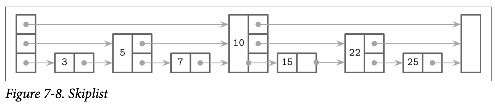
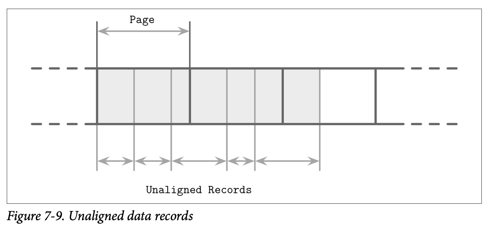
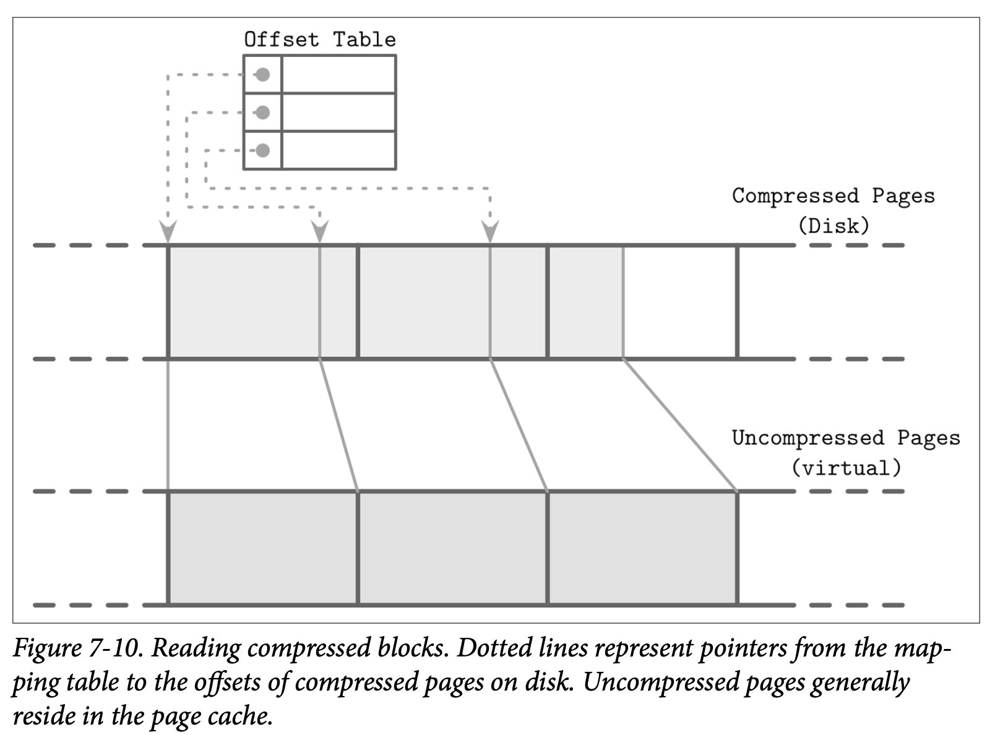

# Implemetation Details

我们已经 LSM Tree 的基本形态：数据如何进行读取、写入跟压缩，但是其中还有一些其他信息，是值得在 LSM Tree 实现中进行讨论的：驻留于内存跟磁盘的表该如何实现，二级索引是如何工作多，如何减少读取访问中对驻留在磁盘表的访问，最后还有关于 *Log-Structured Storage* 结构化日志存储的一些新的想法。

## Sorted String Tables

到目前为止我们已经讨论了 LSM Tree 的层级及逻辑结构 *(他们是有多个驻留在内存跟磁盘的组件组成的)*，但还没有讨论过驻留在磁盘中的表是如何实现的，以及这些元素是如何在整个系统中协同工作的。

磁盘驻留的表一般会使用 *Sorted String Tables (SSTables)* 来实现，就如名字所暗示的一样，SSTables 中的数据记录是按照 Key 的顺序有序存储的。SSTables 通常会包含两个组件：索引文件跟数据文件，索引文件使用了能够提供对数查找时间的数据结构 *(如 B-Trees)* 来实现， 或是其他能提供常数时间查找复杂度的数据结构，比如 HashTables。

数据文件会按照 Key 的顺序来保存，但使用 HashTable 来并不能够防止我们对区间进行扫描，因为 HashTable 只能够定位到区间中的第一个 Key，区间自身的数据则需要我们顺序的读取数据文件，一直到区间的断言不匹配为止。

索引组件包含了 Key 跟对应的 Data Entries *(数据记录在数据文件中的偏移量)*。数据组件则包含了相连的键值对。我们在 Chapter 3 中讨论的 Cell 的设计跟数据记录的格式非常适用于 SSTables。其中主要的区别在于 Cell  会按顺序的进行写入以及他的内容在 SSTable 的生命周期中是不会进行修改的。因为索引文件保存了指向数据文件对应数据记录的指针，因此在索引创建时需要先确定数据记录对应的偏移量。

在压缩期间，数据文件可以在不使用索引组件时进行顺序的读取。因为文件中的数据记录已经是有序的。因为在压缩期间进行合并的已经是有序的，并且合并的迭代器也是保持有序的，因此合并的结果可以在一次顺序的写入中完成。当文件被完全的写入之后，就可以认为他是不可变的了，因此他驻留在磁盘中的内容也不可以再进行修改了。

> ### SStable-Attached Secondary Indexes
>
> 一个由 Apache Cassandra 使用 LSM Tree 作为索引的有趣的实现叫 *SStable-Attached Secondary Indexes (SASI)*。为了允许索引表能够支持其他的字段，而不是只适用于主键，因此索引的结构及他的生命周期需要跟 SSTable 的生命周期绑定，并且每个 SSTable 都有独立的索引。当 Memtable 被刷新时，他的内容被写到磁盘中，并且会以独立于主键索引的方式来为其创建二级索引文件。
>
> 因为 LSM Tree 缓存了数据到内存中，因此索引也需要跟驻留在磁盘的文件一样对其进行支持，SASI 在内存中维护了一个独立的数据结构，来为 Memtable 的内容提供索引。
>
> 在读取时，要检索的数据记录的主键会通过索引进行查找跟合并，之后数据记录的合并跟整合则跟正常的 LSM Treed 查找一样。

## Bloom Filters

LSM Tree 会产生读放大的原因在于，为了完成读取操作，我们需要对多个驻留磁盘的表进行查找。这是因为我们并不是总是能够预先知道驻留在磁盘的表是否包含需要查找的目标 Key。

有一个用来防止对表进行查找的方法是将 Key 的区间信息 *(即对应表最小跟最大的 Key)* 保存到元数据中，用来确认目标的 Key 是否包含在对应的表中。只是这个信息不够精确，因为他只能够告诉我们数据记录 ***可能*** 出现在这个表中，为了改善这个情形，许多的实现比如 Apach Cassandra 跟 RocksDB 都使用了一个称为 *Bloom filter* 的数据结构。

> 基于概率性的数据结构比通常的数据结构更节省空间。比如检查集合成员的基数 *(得到唯一元素的个数)* 或频率 *(得到某个元素被访问的次数)*，我们需要存储集合中的所有元素，并遍历整个数据集来得到结果。概率性的数据结构让我们存储一个近似的信息，并在查询中返回一个不具有确定性的结果。通常比较常见且广为人知的数据结构是 Bloom filter *(用来检查成员)*、HyperLogLog *(用来检查基数)* 跟 Count-Min Sketch *(用来检查频率)*

Bloom filter 由 Burton Howard Bloom 于 1970 年构思，他是一个非常节约空间的概率数据结构，可以用来检查一个元素属不属于一个集合。他能够产生一个正向的 False 结果 *(表示元素在集合中，尽管他可能并不在)*，但不能产生一个负向的 False 结果 *(即当匹配结果为 False 时，保证该元素不在集合中)*。

换句话说，Bloom filter 可以是用来告诉我们一个 Key 可能存在一个表中，或是绝对不会存在在一个表中。因此在 Bloom filter 返回了一个负向的匹配结果时，我们就可以在这个查询中跳过该文件了，并去读取其他的文件确认该数据机构是否真的存在。在驻留于磁盘的表上使用 Bloom filters 能够大量的减少读取操作中需要读取磁盘的次数。

Bloom filters 使用了一个巨大的二进制数组以及许多的 Hash 函数，Hash 函数会应用到需要查找的表的 Key 上，来得到这个数组上的一个索引位置并将该位置设置为 1。通过确认所有 Hash 函数对应的位都被设置为 1 来确认该 Key 存在于指定的集合中。在查找时，为了确认元素是否存在于 Bloom filter 中，Hash 函数会对该 Key 重新进行计算，最终如果所有 Hash 函数计算出对应的位都为 1，则返回一个正向的结果，来表示该元素有极大的可能存在于目标集合中。如果其中一个 Hash 函数对应的位为 0，则我们可以确认这个元素不存在于指定的集合中。

Hash 函数可以为不同的 Key 返回相同的索引位，这称为 *Hash Collision* 哈希碰撞，而且 1 个位只是意味着有些 Hash 函数在某些 Key 上返回了这个索引位置。

正向 False 的概率是通过 Bit 集合的大小跟 Hash 函数的个数来决定的：在一个巨大的 Bit 集合中产生碰撞的概率相对会低得多；类似的，有更多的 Hash 函数我们就可以检查更多的位来得到更精确的结果。

更大的位集合需要更多的内存，而更多 Hash 函数则会对性能造成负面的影响，因为我们需要找到一个合理的值来得到一个可接受的概率跟对应需要承担的开销。概率可以通过期望的集合大小来计算，因为 LSM Tree 中的表是不可变的，因此集合的大小 *(即表中 Key 的数量)* 是可以预估的。

接下来看一个简单的例子，如 Figure 7-7 所示，我们有一个 16 位的位数组，以及 3 个Hash 函数，他们为 Key1 返回了索引 3， 5  跟 10。我们知道集合在这些位上的只，然后下一个 key2 以索引位置 5，8 跟 14 的索引位置被添加了进来，因此这些位也被设为了 1。

现在我们尝试检查 key3 是不是存在于集合中，Hash 函数为这个 key3 计算出了 3，10 跟 14，因为这些位已经由 key1 跟 key2 设置了，因此我们得到了一个 Bloom filter 中返回正向 False 的场景：key3 并没有被添加到集合中，但计算的结果位都被设置了。只是，因为 Bloom filter 只是声明了这个元素 *might* 可能存在于表中，所以这个结果是可以接受的。

如果我们尝试查找 key4，并且 Hash 函数返回了 5，9 跟 15，我们发现只有 5 这个位是被设置的，其他的两个位置都为 0，只要有一个位是没被设置的，我们就可以确认这个元素没有被添加到集合过。

## Skiplist

有许多种不同的数据结构可以用来在内存中保存有序的数据，一个由于其简易性在当前变得比较流行的结构叫做 *Skiplist*，在实现上，Skiplist 并不会比一个 *singly-linked list* 单向链表要复杂多少，同时他能有接近查找树的复杂度保证。

Skiplist 不需要在插入或者更新时执行旋转或重新分配的操作，他使用的是一个概率上的平衡。Skiplist 相对基于内存的 B-Tree 具有更低的 *Cache-friendly* 缓存亲和度，因为 Skiplist 的节点比较小而且在内存中是随机分配的。因此有一些实现为了改善这个问题使用了 *unrolled linked lists*。

一个 Skiplist 由一系列的不同 *height* 高度的节点组成，不同高度层级的链接节点可以用来跳过一些元素区间。每个节点都持有一个 Key，但跟链表不同的是，有些节点会有不只一个后继节点。高度为 h 的节点可以由一个或多个高度不高于 h 的前驱节点连接过来。最低高度的节点则可以从任意高度的节点连接。

节点的高度在插入时由一个随机函数来决定，相同高度的节点组成一个级别。为了避免无限的增长，级别是有上限的，这个最大的高度则是取决于该结构将要保存的元素数量，在每个级别之间节点的数量会指数性的减少。

查找的方式是跟随节点的最高级别，如果查找过程中遇到的节点的 Key 比现在正在进行查找的更大，则会使用该节点当前层级前驱的下一个级别的节点继续进行查找。换句话说，如果查找的 Key 大于当前节点的 Key，查找会继续执行。如果查找的 Key 小于当前的 Key，查找会从前驱节点的下一个级别继续。这个处理的过程会一直递归的重复直到目标 Key 或对应的前驱被定位到。

举例来说，Figure 7-8 中展示了在 Skiplist 中查找 key 7 的步骤：

1. 从最高级别的指针开始，找到了持有 key 10 的节点
2. 因为 key 7  小于 10，则跟随头节点的下一个级别的指针找到了 key 5
3. 跟随该节点最高级别的指针，再次定位到了持有 key 10 的节点
4. 因为 key 7 小于 10， 所以跟随持有 key 5 的节点的下一个级别的指针，从而定位到了 key 7

在插入时，使用刚到的查找算法找到插入点 *(即持有目标 key 或其前驱节点)*，然后创建一个新的节点。为了构建出类似树的层级结构并保持他的平衡，会使用一个基于可能的数据分布产生的随机数字来作为该节点的高度，持有的 Key 小于这个刚创建节点的 Key 的前驱节点会指向该节点，他们的高度指针信息则保持不变。新创建节点上会建立指向其后继节点的各个层级的指针。

在删除时，被删除节点的指针会被其前驱节点的对应级别的指针替换。

我们可以使用一个额外的 *fully_linked* 标志来确认节点是否已经被完全更新，以此来创建一个实现了线性化语义的并行的 Skiplist 版本，这个标志可以使用 *Compare-and-Swap* 来进行设置，这个标志位也是必须的，因为需要更新节点的多个层级的指针才能恢复该节点的信息。

在不使用内存托管的语言中，引用计数或悬垂指针可以用来确认那些被并行访问的节点是否已经被释放，这个算法是一个 *deadlock-free* 无死锁的实现，因为节点必然能够通过更高的级别来进行访问。

Apache Cassandra 使用了 Skiplist 来作为二级索引 Memtable 的实现，WiredTiger 则使用 Skiplist 来实现了一些内存中的操作。

## Disk Access

因为大部分的表内容是保存在磁盘中的，而且存储设备通常都是基于数据块来进行访问的，许多 LSM Tree 的实现都依赖于页缓存来进行磁盘访问跟实现其他的中间缓存。我们在 Buffer Management 中讨论的许多技术如页驱逐跟 Pining 也适用于结构化日志存储引擎。

其中最显著的区别是，内存中的内容是不可变的，因此不需要额外的锁来支持并发的访问。引用计数则用来保证当前访问的页不会被从内存中驱逐，在压缩期间，执行中的请求则会在相应的文件在删除前完成。

另一个不同的点是 LSM Tree 中的数据记录不需要按页对齐，指针可以使用绝对的偏移量而不是页 ID 来定位。在 Figure 7-9 中，你可以看到记录的内容并没有按照磁盘块对齐，有一些记录跨越了页的边界，因此需要读取多个页到内存中。

## Compression

我们在 B-Tree 的 Compression 中也讨论过关于压缩的话题，其中类似的想法也适用于 LSM Tree。其中主要的区别是 LSM Tree 的表是不可变的，而且通常都是可以通过一轮写入完成。当按页压缩数据时，压缩的页并不是按页对齐的，因为他们的大小会小于未压缩时的大小。

为了能够定位压缩后的页，我们需要在写入其内容时跟踪对应的地址边界，可以通过为压缩后的页添加零值来让他们变为按页对齐，但这样也会同时时区了压缩的好处。

为了保证压缩后的页能够定位，我们需要一个间接层来存储压缩后的页的偏移量跟大小，Figure 7-10 展示了压缩有的块跟未压缩块的映射。压缩后的页通常都是小于原始页的，否则就没有进行压缩的意义了。

在压缩跟刷新中，压缩后的页被顺序的添加到最后，然后压缩的相关信息 *(原始页的偏移量跟压缩后的偏移量)* 被保存在一个独立的文件中。在读取时，压缩后的页的偏移量跟他的大小会被查找出来，然后该页会被在内存中解压跟重新构建出来。