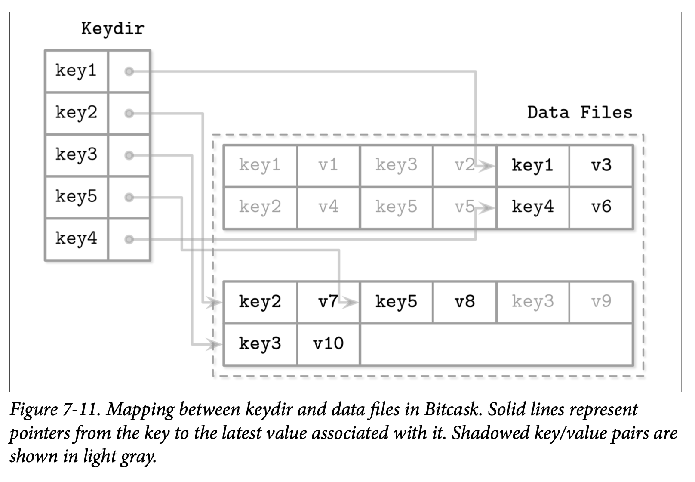

# Unordered LSM Storage

到目前为止所讨论的大部分存储数据结构都是将数据有序存储的。包括可变跟不可变的 B-Tree 的页，有序的 FD-Trees 跟 LSM Tree 的 SSTable，都是按照数据记录的 Key 的顺序来存储的。这些结构的顺序是不一样的：B-Trees 的页是就地更新的，FD-Tree 则是将两个轮次合并为一个，SSTables 则是将数据记录有序的缓存在内存来实现。

在这一节，我们讨论一个使用随机顺序来保存数据记录的结构。无序的存储通常不需要独立的日志记录，也能够让我们通过按照插入顺序来减少写入磁盘的开销。

## Bitcask

Bitcask 是 Riak 使用的其中一个存储引擎，他是一个无需的结构化日志存储引擎。不像至今为止我们讨论的结构化日志存储的实现，他不需要使用 Memtable 来作为缓存，而是直接将数据记录存储到日志文件中。

为了让这些记录能够被搜索，Bitcask 使用一个称为 *keydir* 的数据结构，他保存了 Key 与其对应的最新数据记录的引用，旧的数据记录可能仍存在于磁盘中，但已经无法从 *keydir* 中找到了，并且会在压缩中被垃圾回收。 *Keydir* 使用了基于内存的、可以从日志文件中重建的 HashMap。

在写入时，Key 跟数据记录会被顺序的添加到日志文件中，最近写入的数据记录的指针则会被写到 *Keydir* 中。

读取操作则通过检查 *Keydir* 来定位查找的 Key，并跟随相应的指针找到日志文件，定位到具体的数据记录。因为在任意时刻只能有 Key 的一个记录存储在 *Keydir* 中，点查就不需要从多个数据源中进行数据的合并了。

Figure 7-11 展示了 Key 跟数据在 Bitcask 数据文件中的映射。日志文件保存了数据记录，*Keydir* 则可以通过 key 来定位到最新的存活数据记录。数据文件中被覆盖的记录 *(那些因为写入或删除被废弃的记录)* 则使用了灰色来表示。

在压缩过程中，所有日志文件中的内容会被顺序的读取、合并，然后写入到一个新的位置中，并且只保留仍然 *live* 存活的，丢弃被覆盖的了的那些数据。Keydir 中的指针信息也会被更新指向数据记录新分配的地址。

数据记录会被直接存储到日志文件中，因此不需要在独立的去维护预写日志，这能够降低磁盘空间的占用跟写放大的问题。这种方式的一个缺点是只能进行点查，没办法支持区间查询，因为 *keydir* 跟数据文件中的记录都是无序的。

这种方式的优点是简化了设计以及为点查提供了非常高的性能。尽管存在多个数据记录的版本，但只有最新的版本可以通过 *keydir* 访问。然而，将所有的 Key 保存在内存中，以及在启动时对其进行重建对于某些场景来说可能带来一些限制。尽管这种方式对点查来说非常合适，当同时他也失去了对区间查询的支持。

## WiscKey

在许多的应用中区间查询都是非常重要的，如果一个无序的数据结构能够具备写入跟空间上的优势，同时又允许进行区间扫描，那就真的是太好了。

WiskKey 通过在垃圾回收时将 Key 按照顺序存储到 LSM Tree 中，以及将数据记录以只添加的方式添加到称为 *vLogs* 的文件进行了解耦。这个方式解决了 Bitcask 中讨论的两个问题：需要将所有的 Key 保存到内存以及需要在启动时重新构建 HashTable。

Figure 7-12 展示了 WiscKey 的 Key 组件，以及 Key 跟日志文件的映射。*vLog* 文件包村了无序的数据记录。Key 则保存到了有序的 LSM Tree 中，并将其指向了日志文件中对应数据记录的最新版本。

因为 Key 相对于数据记录来说是非常小的，因此对他们进行压缩会更加的高效。这种方式对较低频率的写入跟删除场景是非常有有用的，因为垃圾回收不需要释放太多的磁盘空间。

其中主要的挑战在于 *vLog* 的数据是无序的，区间的扫描需要随机的 I/O 操作。WiscKey 在区间扫描时使用了内部的 SSD 并行预读块机制来减少随机 I/O 的开销。但就块的传输而言，其成本仍然很高：为了在扫描过程中获取一条数据记录需要将整个页都读取进内存。

在压缩期间，*vLog* 文件的内容会被顺序的读取、合并然后写入到新的位置。指针 *(即 LSM Tree 中 Key 对应的值)* 会被更新指向对应的新的位置。为了避免扫描整个 *vLog* 的内容，WiscKey 使用 *head* 跟 *tail* 指针来保存 vLog 中保存了存活 Key 的信息。

因为在 *vLog* 中的数据是无序且没有保存存活相关的信息，Key 的树需要进行扫描来确定哪些值是仍然存活的。这些检查会在垃圾回收时引入额外的复杂度：传统的 LSM Tree 在压缩时处理文件内容是不需要去定位 Key 的索引信息的。