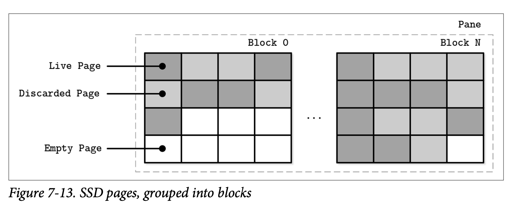
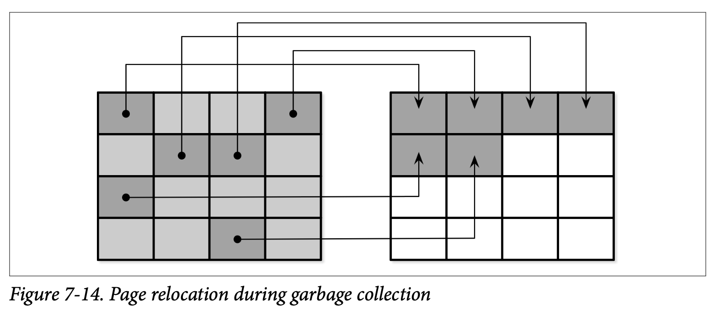
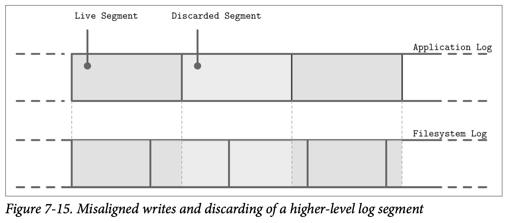
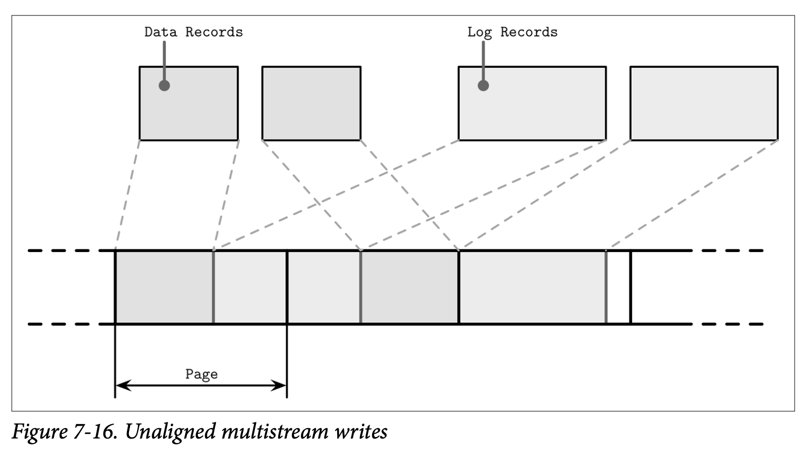

# Log Stacking

许多现在的文件系统都使用了结构化日志：他们将写入的内容缓存到内存段中，然后在缓存满的时候以只添加的方式将数据写入到磁盘。SSD 也会使用结构化日志存储，用来处理随机的小写入，最小化写入的开销，来减少磁盘的损耗提高设备的有效期。

结构化日志存储 *(LSS)* 系统在 SSD 变得越来越普及跟能被承担的同时流行起来。LSM Tree 跟 SSD 具有很好的匹配度，因为顺序写入的方式跟只添加的写入能够减少就地更新带来的放大问题，这一点是会对 SSD 的性能带来巨大负面影响的。

如果我们将多个结构化日志日系统叠加到一起，可能会重新遇到许多我们尝试使用 LSS 去解决的问题，包括写放大、碎片化跟较弱的性能。最起码我们需要在开发的过程中时刻关注 SSD 闪存的转换层跟文件系统。

## Flash Translation Layer

将结构化日志映射到 SSD 中有两个正向的因子：随机的小写入可以被批量写入到物理页上，这正是 SSD 使用 Program/Erase 循环的工作方式。写入也可以只写到之前删除的页中。这意味着除非页是空的 *(也就是说被删除的)* 否则他不能够被 *Programmed* *(也就是写入)* 。

一个 *single* 独立的页不能够被删除，只有由多个页组成的块 *(通常会包含 64 到 512 个页)* 才能进行删除。Figure 7-13 展示了由页组成的块的表现形式。*Flash translation layer (FTL)* 将逻辑页的地址转换为物理地址并会负责跟踪这些页的状态 *(存活、丢弃或是空的)*。当 FTL 已经没有空闲的页时，他会去执行垃圾回收跟删除那些被丢弃的页。

这里并不保证块中所有的页都会被擦除跟丢弃，在块可以进行擦除之前，FTL 需要将仍然存活的页重新分配到另一个包含空闲页的块中。Figure 7-14 展示了将存活页从一个块移到新位置的处理。

在存活的页被重新分配之后，这个块就可以被安全的擦除，然后块中的空页才能够进行写入。因为 FTL 能够感知页的状态及其变化和其他所有必须的信息，所以他还需要负责均衡 SSD 的损耗。

> 损耗均衡的分布在存储介质中，避免产生热点，能够防止块因为太高的 Program-Erace 循环而过早损坏。因为 Flash Memory Cell 只能经历有限的 Program-Erase 循环，因此使用均衡的使用内存 Cell 能够有效的延长设备的寿命。

最后的总结是，在 SSD 中使用结构化日志存储的动机是为了通过批量执行随机的写入来分摊 I/O 的开销，这能够得到更少量的操作及减少垃圾回收触发时所需的时间。

## Filesystem Logging

除此之外，我们还提到了文件系统，他们也会使用日志的技术来提供写缓存，用于降低写放大跟尽量利用底层的硬件优化机制。

日志堆叠展示了一种有些不同的方式，首先每一层都需要管理自己的簿记信息，而且为了避免重复的工作，底层的日志不会公开相关的信息。

*Figure 7-15* 展示了高层级的日志 *(如应用程序的)* 跟低层级日志 *(如文件系统的)* 的映射导致了冗余的日志记录以及不同的垃圾回收模式。写入不对称的段会让情况变得更糟，比如丢弃高层级的日志段可能会导致邻接的段产生碎片跟需要重新分配。

因为层级之间没有就 LSS-related 的调度进行沟通 *(比如丢弃或重分配某些段)*，低层级的子系统可能会对已经丢弃或即将被丢弃的数据进行重复的操作。类似的，因为没有唯一的标准的段的大小，这可能会导致高层级的段会使用多个低层级段的大小导致不对称。所有的这些开销都应该被减少会完全避免。

尽管我们说结构化日志存储都是顺序的 I/O，但仍然要注意数据库系统中可能会同时有多个写入的流 *(比如同时进行的日志写入跟数据记录的写入)*。在硬件层级上进行考虑，交替的顺序性写入可能无法被转换为相同的顺序模式：块不一定要按照写入的顺序来进行排序。Figure 7-16 展示了多个流在时间线上重叠的场景，写入的数据记录并不会跟底层硬件的页大小对其。

这导致了我们本来想要避免的碎片化，为了减少交替的操作，有些数据库的供应商将日志保存在独立的设备中，来隔离不同的工作负载，以保证设备中会始终使用相同的访问模式来提高性能。因此，重要的是保证分区跟底层的硬件对齐并保持写入会按照页进行对齐。