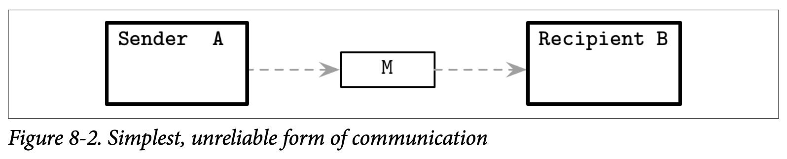

# Distributed System Abstractions

当我们谈到编程语言的时候，会用一些常用的术语来定义这个语言，比如用函数、操作符、类、变量跟指针这些。

有这些通用的词汇能够帮助我们避免在讨论一些东西时去创造新的词汇。他让我们在做定义的时候能够更精确及减少歧义，这有助于读者们能够对我们所说的有更好的理解。

在我们进入对算法的讨论之前，我们首先要对分布式系统涉及的词汇进行介绍：对我们在书中或论文中最长遇到的做出明确的定义。

## Links

网络常常是不可靠的：消息可能会丢失、延迟或是被重新排序。现在带着我们心中已有的想法，我们会尝试来构建许多通信的协议。首先我们会从一个具有最低可靠性跟健壮性的协议开始，标识其中的各种状态，并找出能够为为协议提供更好保证的一些额外信息。

### Fari-loss link

我们从两个处理器开始，他们之间建立了 *link* 连接。处理器之间可以相互发送信息，如 Figure 8-2 所示，所有的传输介质都不是完美的，他们之间的消息可能会丢失或有延迟。

现在来看看我们能够得到什么样的保证。在消息 M 被发送之后，从发送者的观点看，他可以处于下列的几种状态：

- 当前未送达到处理器 B *(但最终会在某个时候送达)*
- 在传输时不可修复的丢失了
- 顺利的送达到远程的处理器

现在我们看到发送者没办法确认消息是否已经送达。在分布式系统的术语中，这种类型的连接称为 *fair-loss*，这种类型的连接具有下面的属性：

- *Fair loss*

  在发送方跟接收方都正确的情况下，发送方会持续的重新发送消息，最终消息肯定会被送达。

- *Finit duplication*

  消息不会被无限次的发送

- *No creation*

  连接上不会出现消息，换句话说，连接不会发送未发送的消息。

 *Fair-loss* 连接是一个非常有用的抽象，也是我们用来构建具有强保证通信协议的第一个模块。我们可以假设这个连接在通信时不会产生丢失消息或是创建新消息的问题。但与此同时，我们还是不能够完全的依赖他，这可能会提醒你还有一种 *User Datagram Protocol (UDP)* 用户数据报协议，他允许我们将消息从一个处理器发送到另一个处理器，但在协议的层面他却不做任何可靠送达的保证。

### Message Acknowledgements

为了改善这个情况跟让消息的状态更加的明确，我们可以引入 *Acknowledgements* 确认：这是一个接收者用来通知发送者他已经顺利接收到消息的机制。因此，我们需要使用双向的通信频道以及添加一些用来区分不同消息的机制，比如使用 *sequence numbers* 序列号，他被用来当做唯一的、严格自增的消息标识符。

现在，处理器 A 可以发送消息 *M(n)*，其中 n 是一个严格自增的消息计数，在处理器 B 接收到这个消息后，他会发送一个确认的 ACK(n) 给 A，如 Figeure 8-3 所展示的通讯。

确认的消息跟原始的消息一样，可能也会以某种形式丢失。因此消息的状态数可能会有一些调整，在 A 接收到 B 回复的确认之前，消息还是会处于之前提到的三个状态之一，但只要 A 接收到了确认消息，就可以确定消息已经被成功的送达至 B 了。

### Message retrasmits

添加确认并不足以将其称为可靠的通信协议：发送的消息仍然可能会丢失，或者远程的处理器也可能会在回复确认之前出故障。为了解决这个问题来提供一个消息送达的保证，我们可以尝试 *restrasmits* 重传。重传是发送者用来处理潜在失败的操作的方式。我们说他是潜在的失败，因为发送方并不能够确认操作是否失败，因为我们现在讨论的连接的类型并没有使用确认机制。

在处理器 A 发送了消息 M 之后，他会等待一个超时时间 T 然后重新发送相同的消息。假设现在两个处理器之间的连接仍然是可用的，网络的分区也不是持续存在的，不是所有的消息报都会丢失，我们就可以声明，从发送者的角度看，消息要么并未送达给处理器 B，或者已经成功送达到处理器 B。因为 A 会持续尝试发送这个消息，因此我们可以说消息不会以不可恢复的形式在传输中丢失。

在分布式系统的术语中，这个抽象被称为 *stubborn link* 倔强的连接，说他是倔强的是因为发送者会无限的重新发送消息，但因为这个小小的抽象是非常不切实际的，所以我们通常需要将重试跟确认两个机制结合起来。

### Problem with retransmits

无论何时我们发送了一个消息，在收到远程处理器的确认之前，我们并不知道这个消息是否已经被处理了，他可能已经很快的被处理了，可能已经丢失了，或者远程的处理器在接收这个消息之前崩溃了，所有的状态都有可能。我们可以重试这个操作来重新发送消息，但这可能会导致产生重复的消息。只有在我们执行的操作是幂等的时候才能够安全的处理重复的消息。

幂等的操作指的是可以重复的执行该操作，并每次都能够在不产生其他副作用的情况下返回相同的结果。比如服务器关闭的操作是幂等的，第一次调用会启动关闭的操作，然后后续所有的调用并不会产生跟其他的副作用。

如果所有的操作都是幂等的，我们就可以减少一些对送达语义的考虑了，而是更多的依赖于重传来实现容错，并以一种被动的方式来构建系统：为某些信号触发指定的动作作为响应，而不会导致产生未知的副作用。但是并不是所有的操作都是幂等的，做这样的假设可能会导致集群级别的副作用，比如，对客户的信用卡进行收费就不是幂等的，因为对信用卡进行了多次的收费肯定是不对的。

幂等对于当前存在的局部故障跟网络分区来说是非常重要的，因为我们没办法确认远程操作的具体状态，即他到底是成功了，失败了还是马上要执行了，我们只能够持续的等。因为每个执行的操作都要求幂等是不切实际的，我们需要提供一种与幂等性相当但无需去对底层操作语义进行修改的保证。为了实现这个目标，我们使用 *Deduplication* 去重来避免对相同的消息进行多次处理。

### Message Order

不可靠的网络需要我们去面对两个问题：消息可能会以错误的顺序送达，因为重传，有些消息还可能会多次送达。我们已经介绍过了消息序号，我们可以通过使用消息序号作为消息的标识符，在接收测来保证 *First-in, First-out (FIFO)* 先进先出的顺序，因为每个消息都有他们的序号，因此接收者可以进行跟踪：

- n~consecutive~ ，表示了当前已经发送的消息中最高的消息序列号，在这个序号之前的消息可以按照顺序来进行排序。
- n~processed~ ，表示了当前排好序并且已经被处理的最高的消息序列号，这个序号可以用来进行去重。

当接收者接收到的消息具有不连续的序号时，他会将其放入重排序的缓存中。举个例子，接收者在接收到消息 3 之后马上收到了消息 5，这时候他知道消息 4 仍未送达，因此我们会将消息 5 存起来直到消息 4 送达，然后就可以将消息按照序号重新进行排序了。因为我们现在是基于 *Fair-loss* 连接来构建的，所以可以假设 n~consecutive~ 跟 n~max_seen~ 之间的消息最终肯定会送达。

接收方也可以安全的丢弃在 n~consecutive~ 之前的消息，因为他们是确认已经安全送达的。

去重则是通过检查消息的序列号 n 是否已经被处理过来实现的，而且已经处理的消息也可以安全的被丢弃。

在分布式系统的术语中，这种类型的连接被称为 *Perfect link* 完美连接，他提供了下列的保证：

- *Reliable delivery*

  每一个由正确的路径 A 发送到正确的路径 B 的消息，最终都会送达。

- *No duplication*

  没有消息会被送达超过一次。

- *No creation*

  跟其他类型的连接一样，他只会传送那些确实被发送的消息。

这几点可能会让你想到 TCP 协议 *(无论如何，TCP 中的可靠送达只在单个会话中进行了保证)*。当然，这个模型在我们的介绍中被进行了简化。TCP 还具有更多的复杂的模型来处理确认机制，比如会将多个确认消息打包来减少协议层面的负载。并且，TCP 也有可选择的确认机制，流量控制，拥塞控制，错误检测跟其他的超出我们讨论范围的特性。

### Exactly-once Delivery

> 分布式系统之中只有两个困难的问题：2. 精确一次送达 1. 对消息顺序的保证 2. 精确一次送达
>
>   -- Mathias Verraes

 对于能否实现 *Exactly-once Delivery* 精确一次送达已经有了许多的讨论，在这里，精确的语义跟明确的描述必须的。因为进行首次尝试时可能存在连接的错误导致消息无法传递，大部分现实世界中的系统都使用了 *at-least-once* 最少一次的方式，他确保了发送者在没有确认消息被明确收到前会一直进行重试。另一种送达的语义是 *at-most-once* 最多一次：发送者发送消息时并不会期望收到送达的确认信息。

TCP 协议会将消息拆分成多个数据包，然后将这些一个一个的发送出去，然后在接收测将他们重新组装起来。TCP 会尝试重传其中的某些数据包，并且可能会不只一次的为了完成传输而进行重试。TCP 会为每个数据包标识序列号，尽管有些数据包会被不只一次的进行重发，但他能够通过去重来保证接收方只会对这个消息进行一次处理。在 TCP 中，这个保证只作用与同一个 *Single Session* 单独的会话：如果消息被确认并且被处理了，但是发送方在连接中断前没有收到确认的消息，所以在应用的层面并不能确认送达的状态，根据他自己的逻辑，可能会尝试再次发送这个消息。

这意味着精确一次处理这一部分是非常有意思的，因为重复的送达 *(或者叫数据包的重发)* 是没有副作用的，他只是传输连接尽力完成传输产生的结果。举例来说，如果数据库的节点收到了数据记录，但还没有进行持久化，这时消息确实是送达了，但除非这个记录后续可以被检索出来否则这个送达没有任何意义 *(换句话说送达跟处理必须都完成)*。

为完成精确一次的保证，节点需要有共同的认识：所有人都了解某个事实，并且所有人都知道所有其他的人都了解这个事实。简单来说，所有的节点都要认同某条记录的状态：所有节点都要知道这个记录是否已被持久化。如你将在本章后面看到的，理论上这是不可能的，但是在实践中我们通常会通过降低协调的要求来实现这个理论。

对于能否实现精确一次送达的误解通常来源于不同的协议、抽象级别跟 *Delivery* 送达的定义。在不能对消息进行多次发送的情况下不可能构建一个可靠的连接，只是我们可以通过只单次处理消息及忽略副本的方式在发送者的视角制造一个精确一次送达的错觉。

现在我们已经建立了一个可靠的通信连接，可以继续往前开始讨论分布式系统中处理器之间一致性的问题了。
