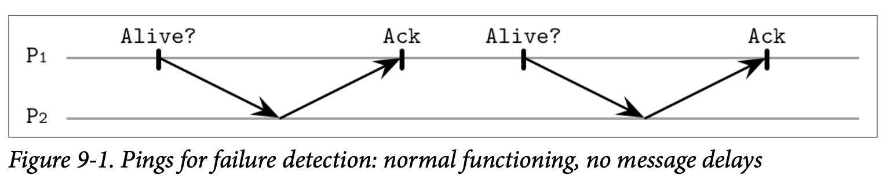
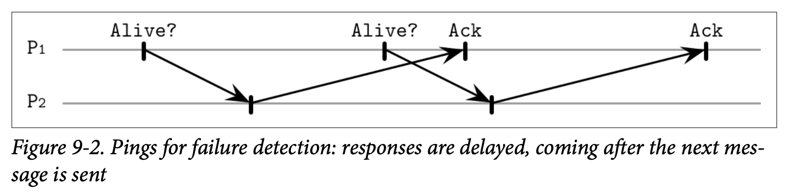

# Heartbeats and Pings

我们可以通过周期性的查询来确认远程处理器的状态：

- 我们可以触发 Ping，他会发送一个消息给远程的处理器，并期望能够在指定的时间周期内得到对方的响应来确认他的存活状态。
- 我们可以触发 Heartbeat 心跳来主动的发送消息来提醒其他节点他现在还在正常的运行着。

我们这里会使用 Ping 来作为一个示例，同样的问题使用 Heartbeat 来处理也能够产生相同的结果。

每个处理器管理了一个其他处理器的列表 *(存活的、故障的跟疑似的)* 并且会使用每个处理器最新响应的时间来进行更细。如果处理器较长时间没有响应 Ping 消息，则其会被标识为 *suspected* 疑似出错。

Figure 9-1 展示了系统的正常功能：处理器 P1 查询其相邻节点 P2 的状态，P2 也对这个查询做出了响应。

另一种不同的是 Figure 9-2 展示了确认消息延迟的情况，这可能会导致这个活跃的处理器被标识为失效。

许多的错误检测算法都是基于心跳跟超时的，比如 Akka，这是一个很流行的用于构建分布式系统的框架，实现了一个 *Deadline failure detector*，他使用心跳，并在固定时间区间内无法成功注册时会被报告为故障状态。

这种方式有一些潜在的缺点：他的准确度取决于如何小心的来选择 Ping 的频率跟超时时间，并且他没有从其他处理器的角度来处理自身的可见性 *(如 Outsourced Heartbeats 中实现的)*。

## Timeout-Free Failure Dector

有些算法会避免依赖于使用超时来进行故障检测，比如 Heartbeat 心跳就是一个无超时的故障检测算法，他只会对心跳信息进行计数，并允许应用通过心跳计数向量中的数据来处理故障。因为这个算法不依赖于超时，因此他能够工作在做出了异步假设的系统中。

这个算法假设两个正确的处理器之间会存在 *fair path* 公平的路线，这个路线中只会包含公平的连接 *(即消息可以从这个连接一直成功的发送，那他就能够一直成功的接收)*，并且每个处理器能够观察到这个网络中的所有其他处理器的存在。

每个处理器管理了他相邻节点的列表以及相关的计数信息。处理器会从向相邻的节点发送心跳开始，每个消息中都包含了心跳消息所经历的路径。其中初始化的消息路径中包含了第一个发送者及其唯一的标识符，用来避免同一条消息被广播多次。

在处理器接收到的新的心跳消息时，他会增加所有在路径中的参与者的计数器，然后将将自己也添加到路径后将心跳发送到另一个不在路径中的节点，处理的过程会在消息已经被发送到所有已知的节点，并确认已经成功收到后停止。*(换句话说就是处理器的标识符已经出现在路径中)*。

因为消息会从不同的处理器中进行传播，因此消息的路径包含了邻接节点所聚合的接收信息，我们可以 *(正确的)* 将一些无法由本机直接触达的处理器标识为活跃的。

心跳计数器展现出了一个全局的归一化的系统视图。这个视图展示了心跳消息是如何从在关联的节点中进行传递的，这让我们可以通过他来对处理器之间进行一些比较。但是，这种方式的一个缺点是对计数器的解释有些棘手：我们需要挑选一个能够返回可靠结果的阈值。在能够确定这个阈值前，这个算法会错误的将活跃的处理器标识成了可疑的。

## Outsourced Heartbeats

另一个可替代的方案是，在 *Scalable Weakly Consitent Infection-style Process Group Membership Protocol (SWIM)* 中使用了 *Outsourced Heartbeat* 外置心跳从邻接节点的视角来提高活跃检测的可靠性。这个方式不会要求处理器对网络中的所有处理器都有所感知，只需要其感知已经连接的子集。

如 Figure 9-3 所示，处理器 P~1~ 发送了 Ping 消息给处理器 P~2~，P~2~ 没有对该消息做出响应，因此 P~1~ 随机的选择了多个随机成员 *(P~3~ 跟 P~4~)*。这些随机的成员会尝试发送心跳信息给 P~2~，如果 P~2~ 响应了消息，则他们会将响应的结果确认给 P~1~。

这让我们可以同时处理直接跟间接的触达性。比如说，如果我们有 P~1~、P~2~ 跟 P~3~ 三个处理器，那我们就可以从 P~1~ 跟 P~2~ 的视角来检查 P~3~ 的状态了。

外置心跳通过将故障检测分布到不同组的成员中来实现其可靠性。这种方式也不需要将消息广播到大量的节点。因为外置心跳的请求可以并行的触发，这种方式可以更快的收集到可疑节点的更多状态信息，以便我们能够做出更精准的决定。