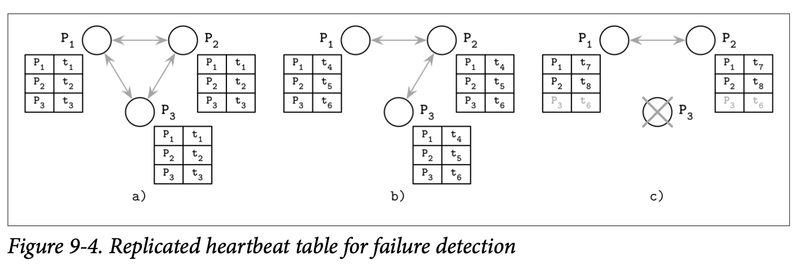

# Gossip and Failure Detection

另一种能够避免依赖于单节点观点来做决定的方式是 Gossip-Style 故障检测服务，他使用了 *gossip* 算法来收集跟分发邻接处理器的状态。

每个成员都会管理一个其他成员的列表，他们的心跳计数器以及时间戳，指示了心跳计数器最后一次增加计数的时间。每个成员会周期性的递增他的心跳计数器跟分发这个列表给一个随机的邻接节点，在收到这个消息后，邻接节点会将接收到的列表跟自身的列表进行合并，然后更新心跳计数器到其他的邻接节点。

节点也会周期性的检查列表中节点的状态跟心跳计数器，如果有节点在足够长的时间内都没有更新他的计数器，则会被当成发生了故障。这个超时的周期应该小心的选择来最小化产生 正向的 False 结果的可能性。至于成员之间相互通信的频率是应该加以限制的 *(换句话说要考虑最糟糕的带宽状态)*，并且最多只能以线性的方式与系统中的节点数同步增长。

Figure 9-4 展示了三个通信的处理器共享他们的心跳计数器：

- *a)* 三个节点能够进行通信跟更新他们的时间戳
- *b)* P3 没办法与 P1 进行通信，但他的时间戳 t~6~ 可以通过 P2 进行传播
- *c)* P3 崩溃了，因为他一致都不进行更新，所以他被其他的处理器检测为故障的。

使用这个方式，我们可以检测到崩溃的、以及集群中其他成员无法触及的节点。这个决定是可靠的，因为我们使用的是集群中多个节点聚合的观点。如果两个主机间的连接产生了故障，心跳依然可以通过其他的处理器来进行传播。使用 Gossip 来传播系统的状态会增加系统中的消息数，但也能够让信息得到更高的可靠性。