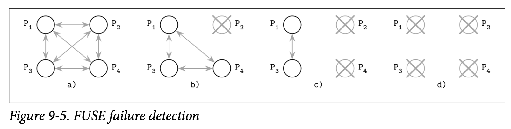

# Reversing Failure Detection Problem Statement

因为传播故障的相关信息并不总是可行的，而且将他们传播到所有的成员的成本也可能会很高昂，有一个称为 *FUSE (Failure notification service)* 的实现方式，着重关注于可靠性以及低廉的故障传播，并且可以在发生网络分区时仍保证正常工作。

为了能够检测到处理器的故障，这个方式将所有活跃的处理器进行了分组，如果其中一个分组不可用了，所有的参与者都能够检测到这个故障。换句话说，单个处理器的每次故障都能被检测到，他会被转换并以 *Group Failure* 组故障的形式传播。这让我们能够检测到任何形式的断线、分区跟节点的故障。

组中的处理器会周期性的发送 Ping 消息给其他的成员，来确认他们是否仍然活跃。如果其中一个成员因为崩溃、网络分区或链接故障没有响应这个消息，则初始化了这个 Ping 的成员会停止对 Ping 消息的响应处理。

Figure 9-5 展示了 4 个处理器间的通信

- *a)* 初始化状态：所有的处理器都活跃且能够相互通信
- *b)* P~2~ 崩溃并且停止了对 Ping 消息的响应
- *c)* P~4~ 检测到了 P~2~ 的故障，因此停止了自身对 Ping 消息的响应
- *d)* 最终 P~1~ 跟 P~3~ 发现了 P~1~ 跟 P~2~ 都失去了响应，此时处理器的故障信息传播到了整个组中

所有的故障都会从故障的源头传播到整个系统中的所有参与者。参与者会逐步的停止响应 Ping 信息，然后将故障从独立的节点转换为整个组的故障。

在这里，我们使用丢失的通信来作为传播的依据。优点是使用这种方式集群中的所有成员都能够确保发现组故障跟对其作出应对。其中一个缺点是两个独立处理器之间的连接问题会扩散为整个组的故障，但这也能作为优点来看，取决于具体的使用场景。应用可以使用自己对故障传播的定义来处理自己的场景。