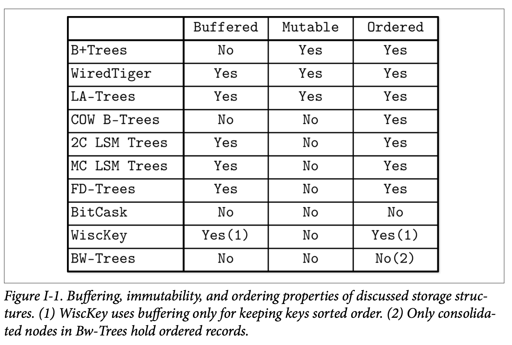

# Part I Conclusion

在 Part I 我们讨论了跟存储引擎相关的信息，我们首先从较高层级的数据库系统架构跟类型做了介绍，学习了如何去实现一个基于磁盘存储的数据结构，以及他们是如果跟系统中的其他组件共同工作的。

我们还从 B-Tree 开始介绍了许多种存储数据结构。不过我们讨论的数据结构并不代表整个领域的状况，还有许多其他的有趣实现没提及的。但是，这些示例已经很好的为我们描绘了我们一开始所说的三个属性：*buffering*、*immutability*、*ordering*。这些属性可以用来很好的描述、记忆跟表达存储数据结构的不同方面。

*Figure I-1* 总结了我们讨论的存储数据结构以及他们跟这三个属性的关系。

添加基于内存的缓存通常都能够对写放大带来正面的改善。在像 *WiredTiger* 跟 *LA-Tree* 这些使用了就地更新的数据结构而言，内存的缓存能够帮助他们将对同一个页的写入进行合并从而分摊了写入的开销。换句话说，缓存能够用来降低写放大。

在不可变的数据结构中，比如多组件的 LSM Tree 跟 FD-Tree，缓存也能带来类似的正面影响，但是这个影响是对于在未来的某个时刻将一个不可变级别的数据重写到另一个级别时产生的。话句话说，使用不可变的形式可能会导致产生延后的写放大问题。与此同时，使用不可变的形式对于并发跟空间放大也会带来正面的影响，因为我们所讨论的大部分不可变数据结构都会完全的填满页。

在使用不可变的形式时，如果不想使用缓存，我们最终会遇到像 *Bitcask* 跟 *WiscKey* 的存储数据结构 *(有一个例外是使用了 Copy-on-Write 的 B-Tree，他会复制、重新排序跟重新分配他的页)*。*WiscKey* 在 LSM Tree 中存储了他的 Key 信息跟对应数据文件的指针，并以此来实现按照 Key 的顺序来访问数据。在 Bw-Tree 中，有部分节点 *(被整合之后的节点)* 会按照 Key 的顺序来保存数据，Bw-Tree 的剩余的逻辑节点则可能会跨多个页来保存其节点的增量更新信息。

你会看到这三个属性可以混合跟搭配来实现所设计的特性，不幸的是，存储引擎的设计通常需要作出一些权衡：提高其中一项操作的开销可能会降低另外两个的成本。

使用这些知识，你应该可以开始更深入的去了解大部分的现代数据库系统的代码了。这些代码中的一部分可以在本书的各个章节中找到对应的引用。对这些术语的理解可能会对理解代码带来许多帮助。

许多现代的数据库系统会使用基于概率的数据结构来进行强化，这些新的研究的想法有些是从机器学习中应用到数据库系统的。随着非易失性跟字节寻址存储变得越来越流行跟更可用，这方面对研究跟工业的可能会带了一些新的变化。

通过本书对这些基础的概念的了解能够帮助你更好的理解跟实现一些新的研究，因为他们通常是借鉴或者构建于或者是从这些概念中收到启发而来的。理解这些理论的优点跟历史有助于我们明白：没有什么东西是突然出现的，正如本书所描绘的，所有的东西都是渐进的。